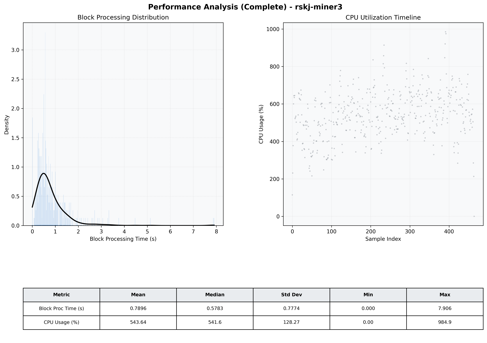

# Miner3 Quantitative Performance Report

| Category | Metric | Unit | Mean | Median | Min | Max |
| :--- | :--- | :--- | :--- | :--- | :--- | :--- |
| Processing | Block Processing Time | s | 0.790 | 0.578 | 0.000 | 7.906 |
|  | BlockExecution JMX | s | 0.580 | 0.356 | 0.032 | 25.417 |
| | Gas Consumed (per block) | M units | 20.81 | 24.30 | 0.84 | 24.93 |
| Resources | CPU Usage per Container | % | 543.64 | 541.61 | 0.00 | 984.95 |
|  | Memory Usage per Container | MiB | 3978.3 | 4060.7 | 687.1 | 4096.1 |
| | CPU & Memory Assigned | - | 2.0 CPU, 4G | - | - | - |
| JVM | JVM Heap Used | MiB | 2066.2 | 2107.0 | 27.6 | 2738.8 |
| | JVM Heap Allocated | MiB | 3072.0 | 3072.0 | 3072.0 | 3072.0 |
| JVM GC | GC Copy Time | s | N/A | N/A | N/A | N/A |
| JVM GC | GC MarkSweep Time | s | N/A | N/A | N/A | N/A |
| Disk I/O | Disk Read | MiB/s | 0.001 | 0.000 | 0.000 | 0.019 |
|  | Disk Write | MiB/s | 0.002 | 0.001 | 0.000 | 0.022 |
| Network | Received Network Traffic per Container | KiB/s | 327.30 | 283.64 | 0.00 | 1085.35 |
|  | Sent Network Traffic per Container | KiB/s | 365.44 | 332.84 | 0.00 | 1198.64 |

