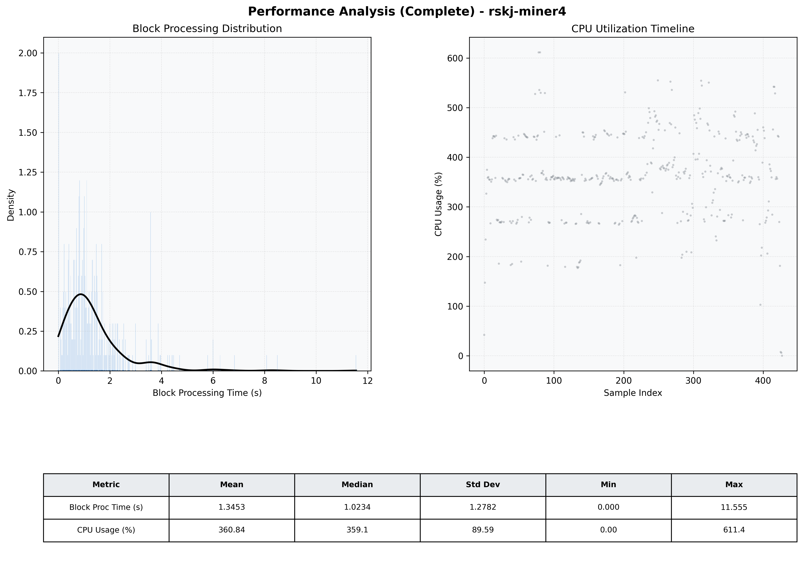

# Miner4 Quantitative Performance Report

| Category | Metric | Unit | Mean | Median | Min | Max |
| :--- | :--- | :--- | :--- | :--- | :--- | :--- |
| Processing | Block Processing Time | s | 1.345 | 1.023 | 0.000 | 11.555 |
|  | BlockExecution JMX | s | 0.723 | 0.507 | 0.000 | 10.894 |
| | Gas Consumed (per block) | M units | 20.81 | 24.30 | 0.84 | 24.93 |
| Resources | CPU Usage per Container | % | 360.84 | 359.08 | 0.00 | 611.38 |
|  | Memory Usage per Container | MiB | 3757.2 | 4050.1 | 0.0 | 4096.5 |
| | CPU & Memory Assigned | - | 1.0 CPU, 4G | - | - | - |
| JVM | JVM Heap Used | MiB | 2057.5 | 2196.6 | 95.8 | 2868.4 |
| | JVM Heap Allocated | MiB | 2969.6 | 2969.6 | 2969.6 | 2969.6 |
| JVM GC | GC Copy Time | s | 0.0314 | 0.0263 | 0.000 | 0.121 |
| JVM GC | GC MarkSweep Time | s | 0.0156 | 0.0000 | 0.000 | 0.674 |
| Disk I/O | Disk Read | MiB/s | 787.365 | 129.807 | 0.000 | 18365.793 |
|  | Disk Write | MiB/s | 0.001 | 0.001 | 0.000 | 0.019 |
| Network | Received Network Traffic per Container | KiB/s | 348.57 | 311.77 | 1.10 | 1258.71 |
|  | Sent Network Traffic per Container | KiB/s | 352.03 | 313.52 | 0.15 | 1190.94 |

