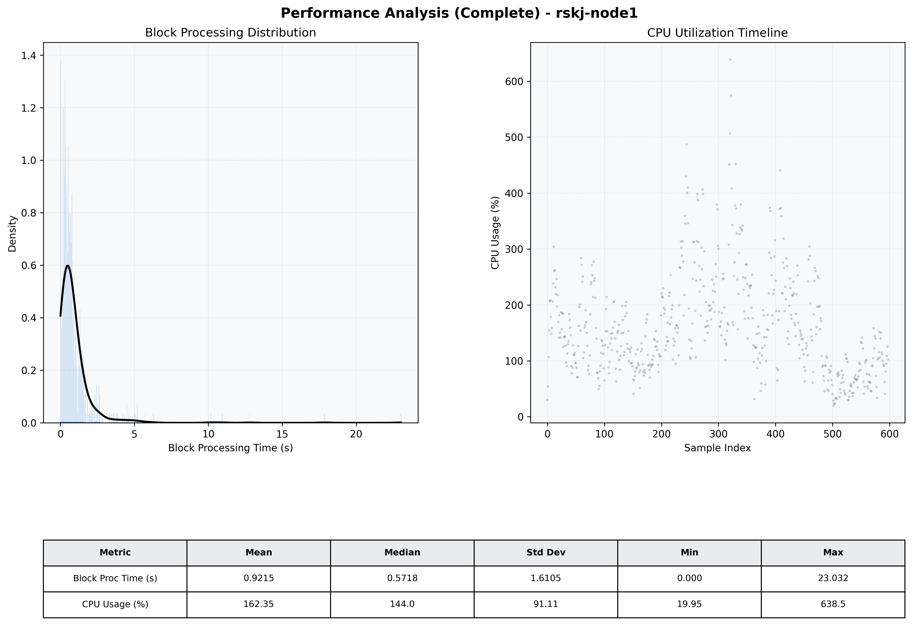

# Node1 Quantitative Performance Report

| Category | Metric | Unit | Mean | Median | Min | Max |
| :--- | :--- | :--- | :--- | :--- | :--- | :--- |
| Processing | Block Processing Time | s | 0.922 | 0.572 | 0.000 | 23.032 |
|  | BlockExecution JMX | s | 0.646 | 0.390 | 0.000 | 21.431 |
| | Gas Consumed (per block) | M units | 20.81 | 24.30 | 0.84 | 24.93 |
| Resources | CPU Usage per Container | % | 162.35 | 143.96 | 19.95 | 638.53 |
|  | Memory Usage per Container | MiB | 3587.4 | 3943.5 | 681.8 | 4095.9 |
| | CPU & Memory Assigned | - | 1.0 CPU, 6G | - | - | - |
| JVM | JVM Heap Used | MiB | 1925.8 | 2072.0 | 128.6 | 2864.4 |
| | JVM Heap Allocated | MiB | 2969.6 | 2969.6 | 2969.6 | 2969.6 |
| JVM GC | GC Copy Time | s | 0.0203 | 0.0151 | 0.000 | 0.121 |
| JVM GC | GC MarkSweep Time | s | 0.0009 | 0.0000 | 0.000 | 0.546 |
| Disk I/O | Disk Read | MiB/s | 278.204 | 16.688 | 0.000 | 13206.813 |
|  | Disk Write | MiB/s | 670.632 | 89.175 | 0.000 | 23703.811 |
| Network | Received Network Traffic per Container | KiB/s | 318.97 | 280.84 | 1.14 | 1302.67 |
|  | Sent Network Traffic per Container | KiB/s | 273.34 | 216.22 | 0.15 | 1251.46 |

