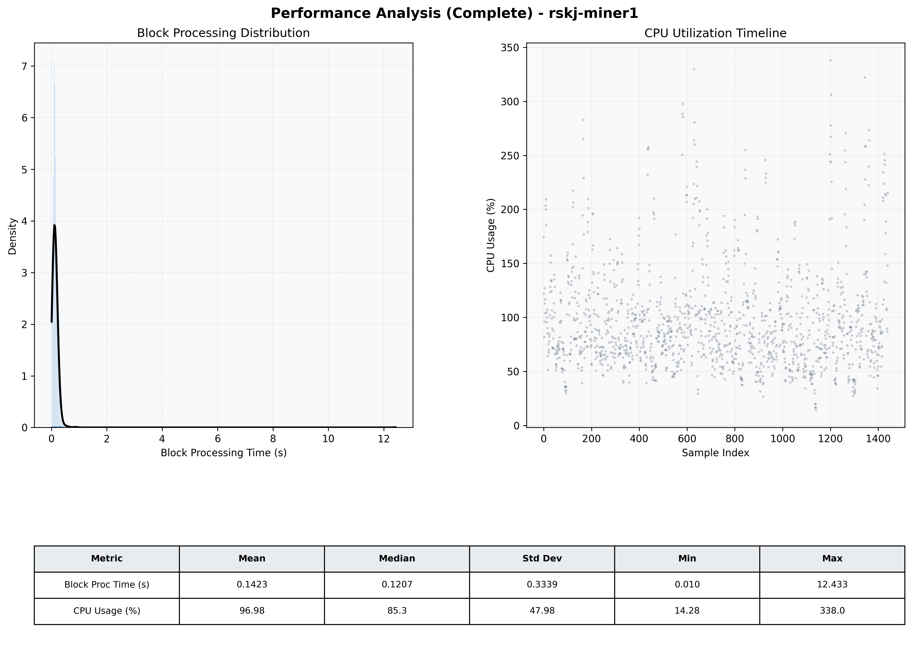

# Miner1 Quantitative Performance Report

| Category | Metric | Unit | Mean | Median | Min | Max |
| :--- | :--- | :--- | :--- | :--- | :--- | :--- |
| Processing | Block Processing Time | s | 0.142 | 0.121 | 0.010 | 12.433 |
|  | BlockExecution JMX | s | 0.072 | 0.061 | 0.005 | 0.565 |
| | Gas Consumed (per block) | M units | 5.87 | 6.58 | 0.00 | 6.97 |
| Resources | CPU Usage per Container | % | 96.98 | 85.27 | 14.28 | 338.00 |
|  | Memory Usage per Container | MiB | 5248.0 | 5197.9 | 4192.9 | 5934.5 |
| | CPU & Memory Assigned | - | 2.0 CPU, 8G | - | - | - |
| JVM | JVM Heap Used | MiB | 1800.3 | 1814.1 | 773.5 | 2726.3 |
| | JVM Heap Allocated | MiB | 3072.0 | 3072.0 | 3072.0 | 3072.0 |
| JVM GC | GC Copy Time | s | N/A | N/A | N/A | N/A |
| JVM GC | GC MarkSweep Time | s | N/A | N/A | N/A | N/A |
| Disk I/O | Disk Read | MiB/s | 13.655 | 0.000 | 0.000 | 6432.468 |
|  | Disk Write | MiB/s | 321.079 | 138.892 | 0.000 | 15857.094 |
| Network | Received Network Traffic per Container | KiB/s | 102.02 | 95.06 | 2.20 | 349.43 |
|  | Sent Network Traffic per Container | KiB/s | 105.26 | 98.17 | 10.41 | 382.07 |

