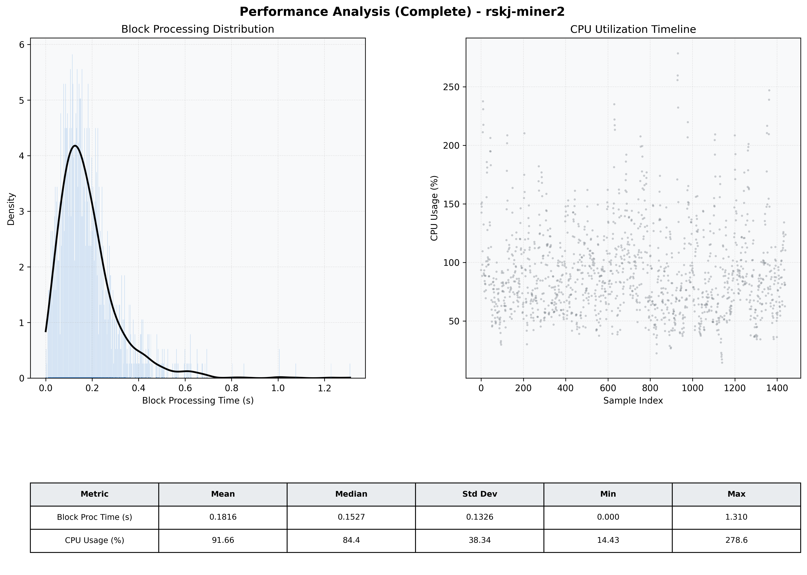

# Miner2 Quantitative Performance Report

| Category | Metric | Unit | Mean | Median | Min | Max |
| :--- | :--- | :--- | :--- | :--- | :--- | :--- |
| Processing | Block Processing Time | s | 0.182 | 0.153 | 0.000 | 1.310 |
|  | BlockExecution JMX | s | 0.102 | 0.082 | 0.005 | 0.890 |
| | Gas Consumed (per block) | M units | 5.87 | 6.58 | 0.00 | 6.97 |
| Resources | CPU Usage per Container | % | 91.66 | 84.41 | 14.43 | 278.56 |
|  | Memory Usage per Container | MiB | 3997.6 | 4025.2 | 3020.3 | 4096.0 |
| | CPU & Memory Assigned | - | 1.0 CPU, 4G | - | - | - |
| JVM | JVM Heap Used | MiB | 1766.5 | 1771.0 | 674.2 | 2851.1 |
| | JVM Heap Allocated | MiB | 2969.6 | 2969.6 | 2969.6 | 2969.6 |
| JVM GC | GC Copy Time | s | 0.0059 | 0.0049 | 0.000 | 0.111 |
| JVM GC | GC MarkSweep Time | s | 0.0009 | 0.0000 | 0.000 | 0.596 |
| Disk I/O | Disk Read | MiB/s | 152.161 | 19.864 | 0.000 | 13559.088 |
|  | Disk Write | MiB/s | 383.150 | 165.374 | 0.000 | 30245.181 |
| Network | Received Network Traffic per Container | KiB/s | 100.31 | 92.34 | 1.68 | 348.55 |
|  | Sent Network Traffic per Container | KiB/s | 112.26 | 104.10 | 10.52 | 362.02 |

