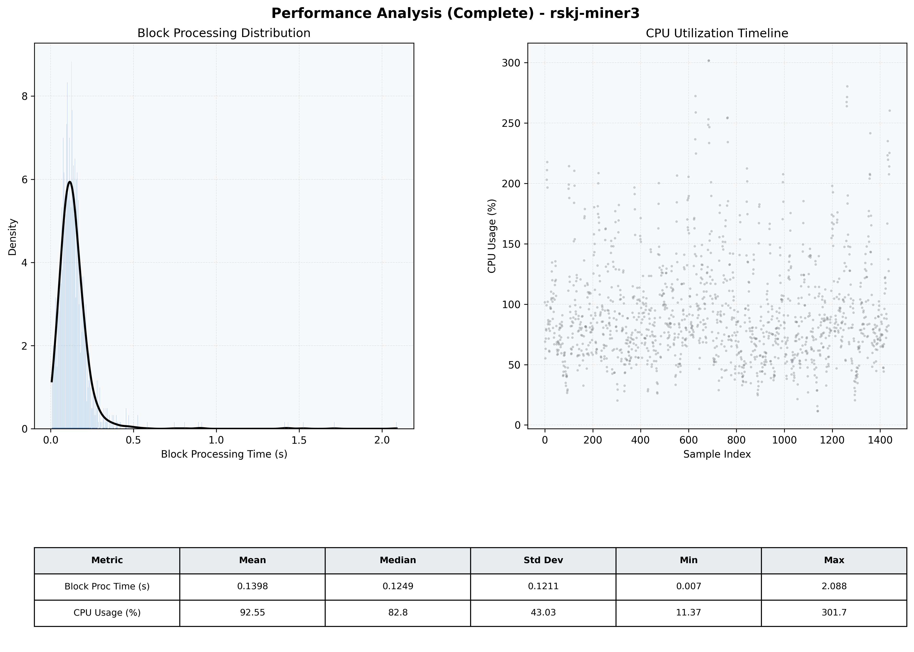

# Miner3 Quantitative Performance Report

| Category | Metric | Unit | Mean | Median | Min | Max |
| :--- | :--- | :--- | :--- | :--- | :--- | :--- |
| Processing | Block Processing Time | s | 0.140 | 0.125 | 0.007 | 2.088 |
|  | BlockExecution JMX | s | 0.087 | 0.072 | 0.004 | 2.061 |
| | Gas Consumed (per block) | M units | 5.87 | 6.58 | 0.00 | 6.97 |
| Resources | CPU Usage per Container | % | 92.55 | 82.83 | 11.37 | 301.71 |
|  | Memory Usage per Container | MiB | 4036.5 | 4044.1 | 3788.1 | 4096.0 |
| | CPU & Memory Assigned | - | 2.0 CPU, 4G | - | - | - |
| JVM | JVM Heap Used | MiB | 1753.6 | 1757.1 | 694.9 | 2724.7 |
| | JVM Heap Allocated | MiB | 3072.0 | 3072.0 | 3072.0 | 3072.0 |
| JVM GC | GC Copy Time | s | N/A | N/A | N/A | N/A |
| JVM GC | GC MarkSweep Time | s | N/A | N/A | N/A | N/A |
| Disk I/O | Disk Read | MiB/s | 244.082 | 45.928 | 0.000 | 16040.412 |
|  | Disk Write | MiB/s | 381.218 | 169.236 | 0.000 | 17001.483 |
| Network | Received Network Traffic per Container | KiB/s | 99.17 | 91.49 | 1.64 | 343.91 |
|  | Sent Network Traffic per Container | KiB/s | 114.18 | 104.82 | 9.69 | 411.10 |

