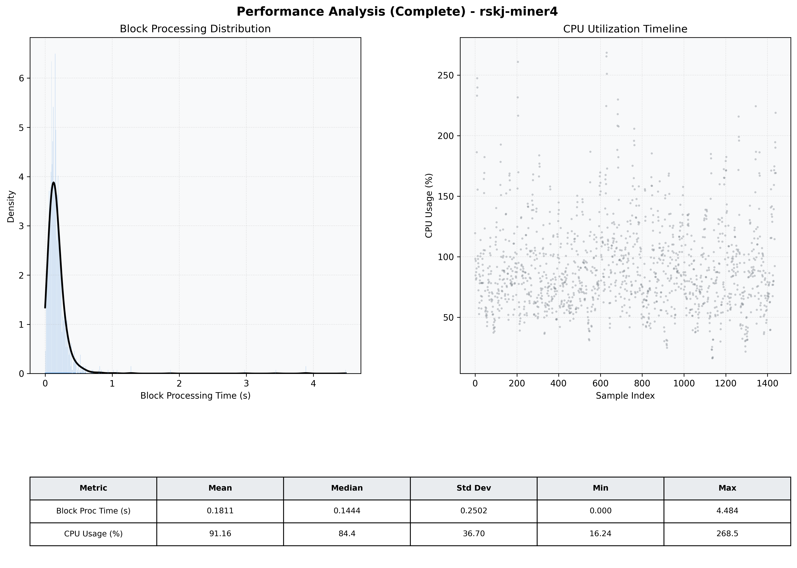

# Miner4 Quantitative Performance Report

| Category | Metric | Unit | Mean | Median | Min | Max |
| :--- | :--- | :--- | :--- | :--- | :--- | :--- |
| Processing | Block Processing Time | s | 0.181 | 0.144 | 0.000 | 4.484 |
|  | BlockExecution JMX | s | 0.114 | 0.078 | 0.004 | 4.411 |
| | Gas Consumed (per block) | M units | 5.87 | 6.58 | 0.00 | 6.97 |
| Resources | CPU Usage per Container | % | 91.16 | 84.36 | 16.24 | 268.52 |
|  | Memory Usage per Container | MiB | 3910.1 | 3990.8 | 3146.0 | 4096.0 |
| | CPU & Memory Assigned | - | 1.0 CPU, 4G | - | - | - |
| JVM | JVM Heap Used | MiB | 1759.4 | 1768.8 | 605.7 | 2854.0 |
| | JVM Heap Allocated | MiB | 2969.6 | 2969.6 | 2969.6 | 2969.6 |
| JVM GC | GC Copy Time | s | 0.0052 | 0.0042 | 0.000 | 0.025 |
| JVM GC | GC MarkSweep Time | s | 0.0006 | 0.0000 | 0.000 | 0.459 |
| Disk I/O | Disk Read | MiB/s | 146.711 | 22.759 | 0.000 | 14160.011 |
|  | Disk Write | MiB/s | 381.980 | 176.953 | 0.000 | 20292.966 |
| Network | Received Network Traffic per Container | KiB/s | 98.82 | 92.82 | 1.63 | 373.57 |
|  | Sent Network Traffic per Container | KiB/s | 116.03 | 108.06 | 2.69 | 373.50 |

