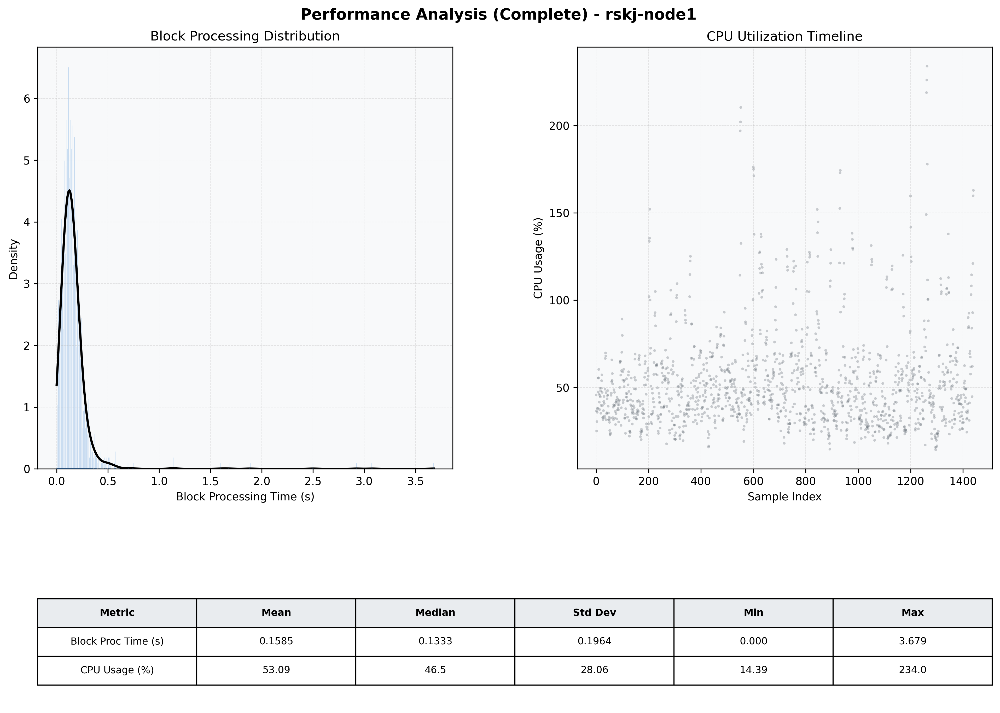

# Node1 Quantitative Performance Report

| Category | Metric | Unit | Mean | Median | Min | Max |
| :--- | :--- | :--- | :--- | :--- | :--- | :--- |
| Processing | Block Processing Time | s | 0.158 | 0.133 | 0.000 | 3.679 |
|  | BlockExecution JMX | s | 0.115 | 0.081 | 0.002 | 6.971 |
| | Gas Consumed (per block) | M units | 5.87 | 6.58 | 0.00 | 6.97 |
| Resources | CPU Usage per Container | % | 53.09 | 46.45 | 14.39 | 233.97 |
|  | Memory Usage per Container | MiB | 3806.1 | 3940.1 | 2784.7 | 4095.8 |
| | CPU & Memory Assigned | - | 1.0 CPU, 4G | - | - | - |
| JVM | JVM Heap Used | MiB | 1811.3 | 1815.0 | 601.7 | 2875.8 |
| | JVM Heap Allocated | MiB | 2969.6 | 2969.6 | 2969.6 | 2969.6 |
| JVM GC | GC Copy Time | s | 0.0036 | 0.0029 | 0.000 | 0.036 |
| JVM GC | GC MarkSweep Time | s | 0.0008 | 0.0000 | 0.000 | 0.590 |
| Disk I/O | Disk Read | MiB/s | 111.334 | 12.966 | 0.000 | 14668.322 |
|  | Disk Write | MiB/s | 218.694 | 20.827 | 0.000 | 17293.014 |
| Network | Received Network Traffic per Container | KiB/s | 121.83 | 114.06 | 1.66 | 378.29 |
|  | Sent Network Traffic per Container | KiB/s | 98.56 | 90.11 | 10.44 | 368.22 |

