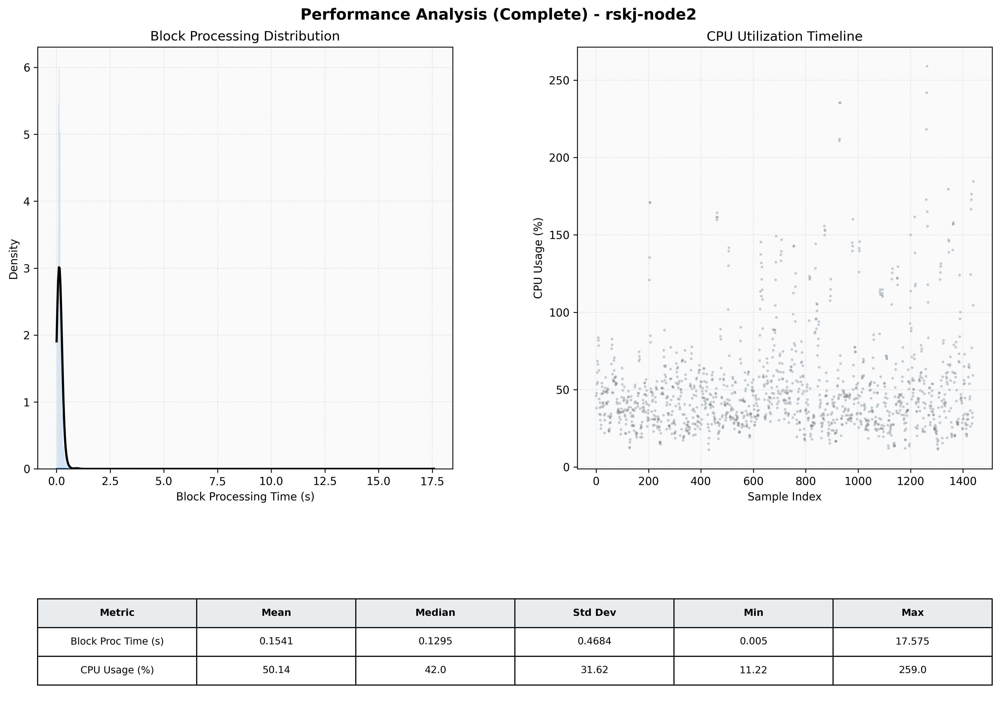

# Node2 Quantitative Performance Report

| Category | Metric | Unit | Mean | Median | Min | Max |
| :--- | :--- | :--- | :--- | :--- | :--- | :--- |
| Processing | Block Processing Time | s | 0.154 | 0.129 | 0.005 | 17.575 |
|  | BlockExecution JMX | s | 0.109 | 0.083 | 0.002 | 17.419 |
| | Gas Consumed (per block) | M units | 5.87 | 6.58 | 0.00 | 6.97 |
| Resources | CPU Usage per Container | % | 50.14 | 42.04 | 11.22 | 259.00 |
|  | Memory Usage per Container | MiB | 4052.8 | 4069.2 | 3858.9 | 4096.0 |
| | CPU & Memory Assigned | - | 2.0 CPU, 4G | - | - | - |
| JVM | JVM Heap Used | MiB | 1555.1 | 1488.6 | 825.4 | 2697.4 |
| | JVM Heap Allocated | MiB | 3072.0 | 3072.0 | 3072.0 | 3072.0 |
| JVM GC | GC Copy Time | s | N/A | N/A | N/A | N/A |
| JVM GC | GC MarkSweep Time | s | N/A | N/A | N/A | N/A |
| Disk I/O | Disk Read | MiB/s | 149.232 | 29.243 | 0.000 | 16088.135 |
|  | Disk Write | MiB/s | 182.047 | 20.274 | 0.552 | 15900.821 |
| Network | Received Network Traffic per Container | KiB/s | 114.43 | 105.63 | 1.69 | 419.00 |
|  | Sent Network Traffic per Container | KiB/s | 94.05 | 87.69 | 9.89 | 312.54 |

