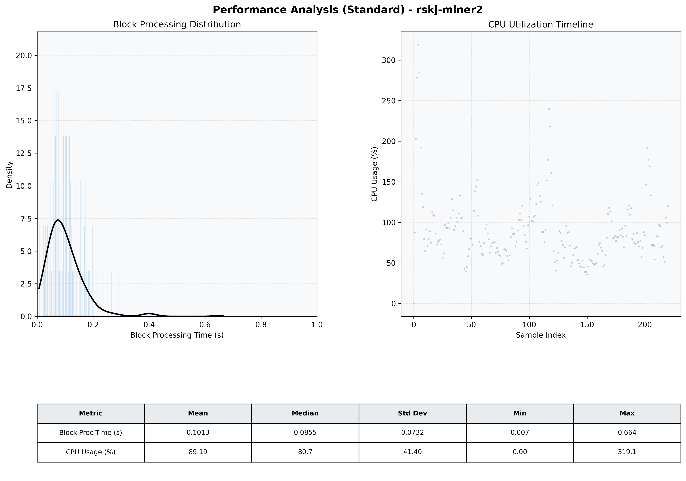

# Miner2 Quantitative Performance Report

| Category | Metric | Unit | Mean | Median | Min | Max |
| :--- | :--- | :--- | :--- | :--- | :--- | :--- |
| Processing | Block Processing Time | s | 0.101 | 0.086 | 0.007 | 0.664 |
|  | BlockExecution JMX | s | 0.064 | 0.050 | 0.008 | 0.302 |
| | Gas Consumed (per block) | M units | 5.98 | 6.44 | 0.00 | 6.94 |
| Resources | CPU Usage per Container | % | 89.19 | 80.67 | 0.00 | 319.08 |
|  | Memory Usage per Container | MiB | 1920.3 | 1945.3 | 283.9 | 2329.2 |
| | CPU & Memory Assigned | - | 1.0 CPU, 4G | - | - | - |
| JVM | JVM Heap Used | MiB | 712.8 | 718.6 | 179.2 | 1299.4 |
| | JVM Heap Allocated | MiB | 2969.6 | 2969.6 | 2969.6 | 2969.6 |
| JVM GC | GC Copy Time | s | 0.0031 | 0.0027 | 0.001 | 0.014 |
| JVM GC | GC MarkSweep Time | s | 0.0000 | 0.0000 | 0.000 | 0.000 |
| Disk I/O | Disk Read | MiB/s | 0.000 | 0.000 | 0.000 | 0.000 |
|  | Disk Write | MiB/s | 255.690 | 174.327 | 0.000 | 3369.241 |
| Network | Received Network Traffic per Container | KiB/s | 108.09 | 99.11 | 0.00 | 286.64 |
|  | Sent Network Traffic per Container | KiB/s | 120.06 | 109.23 | 0.00 | 377.73 |

