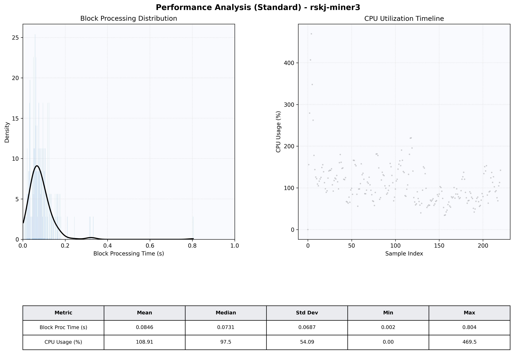

# Miner3 Quantitative Performance Report

| Category | Metric | Unit | Mean | Median | Min | Max |
| :--- | :--- | :--- | :--- | :--- | :--- | :--- |
| Processing | Block Processing Time | s | 0.085 | 0.073 | 0.002 | 0.804 |
|  | BlockExecution JMX | s | 0.053 | 0.041 | 0.007 | 0.714 |
| | Gas Consumed (per block) | M units | 5.98 | 6.44 | 0.00 | 6.94 |
| Resources | CPU Usage per Container | % | 108.91 | 97.48 | 0.00 | 469.49 |
|  | Memory Usage per Container | MiB | 3159.1 | 3206.0 | 383.1 | 3642.9 |
| | CPU & Memory Assigned | - | 2.0 CPU, 4G | - | - | - |
| JVM | JVM Heap Used | MiB | 1216.3 | 1198.2 | 108.7 | 2302.8 |
| | JVM Heap Allocated | MiB | 3072.0 | 3072.0 | 3072.0 | 3072.0 |
| JVM GC | GC Copy Time | s | N/A | N/A | N/A | N/A |
| JVM GC | GC MarkSweep Time | s | N/A | N/A | N/A | N/A |
| Disk I/O | Disk Read | MiB/s | 0.007 | 0.000 | 0.000 | 1.241 |
|  | Disk Write | MiB/s | 272.919 | 166.195 | 0.000 | 2610.567 |
| Network | Received Network Traffic per Container | KiB/s | 104.94 | 95.09 | 0.00 | 285.72 |
|  | Sent Network Traffic per Container | KiB/s | 123.91 | 112.61 | 0.00 | 359.52 |

