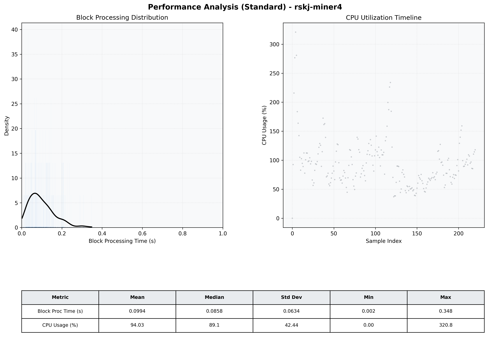

# Miner4 Quantitative Performance Report

| Category | Metric | Unit | Mean | Median | Min | Max |
| :--- | :--- | :--- | :--- | :--- | :--- | :--- |
| Processing | Block Processing Time | s | 0.099 | 0.086 | 0.002 | 0.348 |
|  | BlockExecution JMX | s | 0.069 | 0.050 | 0.009 | 0.885 |
| | Gas Consumed (per block) | M units | 5.98 | 6.44 | 0.00 | 6.94 |
| Resources | CPU Usage per Container | % | 94.03 | 89.13 | 0.00 | 320.82 |
|  | Memory Usage per Container | MiB | 1957.8 | 2004.3 | 305.1 | 2385.4 |
| | CPU & Memory Assigned | - | 1.0 CPU, 4G | - | - | - |
| JVM | JVM Heap Used | MiB | 723.5 | 731.5 | 110.7 | 1332.7 |
| | JVM Heap Allocated | MiB | 2969.6 | 2969.6 | 2969.6 | 2969.6 |
| JVM GC | GC Copy Time | s | 0.0029 | 0.0025 | 0.000 | 0.014 |
| JVM GC | GC MarkSweep Time | s | 0.0000 | 0.0000 | 0.000 | 0.000 |
| Disk I/O | Disk Read | MiB/s | 0.000 | 0.000 | 0.000 | 0.000 |
|  | Disk Write | MiB/s | 289.577 | 206.193 | 0.000 | 2677.749 |
| Network | Received Network Traffic per Container | KiB/s | 107.96 | 98.29 | 0.00 | 270.37 |
|  | Sent Network Traffic per Container | KiB/s | 120.98 | 109.81 | 0.00 | 317.64 |

