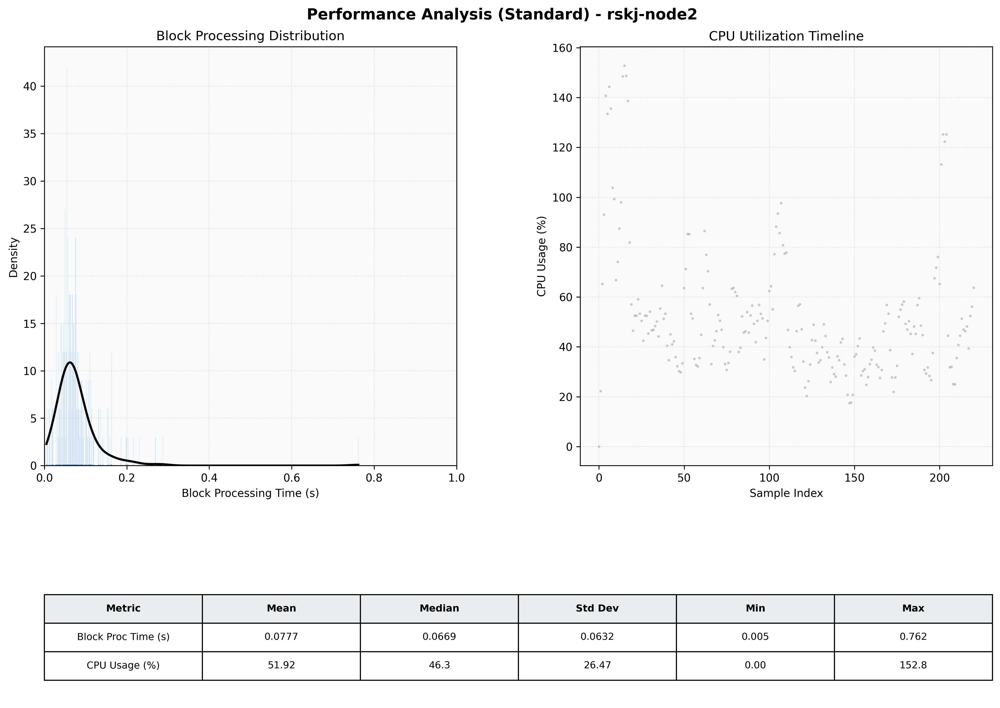

# Node2 Quantitative Performance Report

| Category | Metric | Unit | Mean | Median | Min | Max |
| :--- | :--- | :--- | :--- | :--- | :--- | :--- |
| Processing | Block Processing Time | s | 0.078 | 0.067 | 0.005 | 0.762 |
|  | BlockExecution JMX | s | 0.061 | 0.049 | 0.000 | 0.744 |
| | Gas Consumed (per block) | M units | 5.98 | 6.44 | 0.00 | 6.94 |
| Resources | CPU Usage per Container | % | 51.92 | 46.28 | 0.00 | 152.77 |
|  | Memory Usage per Container | MiB | 2903.7 | 2983.5 | 376.7 | 3284.2 |
| | CPU & Memory Assigned | - | 2.0 CPU, 4G | - | - | - |
| JVM | JVM Heap Used | MiB | 1049.3 | 1023.6 | 114.0 | 2130.6 |
| | JVM Heap Allocated | MiB | 3072.0 | 3072.0 | 3072.0 | 3072.0 |
| JVM GC | GC Copy Time | s | N/A | N/A | N/A | N/A |
| JVM GC | GC MarkSweep Time | s | N/A | N/A | N/A | N/A |
| Disk I/O | Disk Read | MiB/s | 0.168 | 0.000 | 0.000 | 37.101 |
|  | Disk Write | MiB/s | 66.107 | 21.654 | 0.000 | 3236.966 |
| Network | Received Network Traffic per Container | KiB/s | 125.97 | 113.67 | 0.00 | 403.76 |
|  | Sent Network Traffic per Container | KiB/s | 99.35 | 92.41 | 0.00 | 267.45 |

