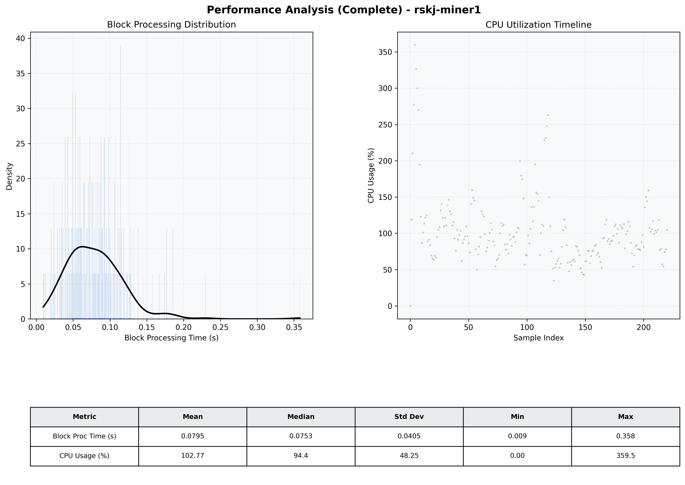

# Miner1 Quantitative Performance Report

| Category | Metric | Unit | Mean | Median | Min | Max |
| :--- | :--- | :--- | :--- | :--- | :--- | :--- |
| Processing | Block Processing Time | s | 0.080 | 0.075 | 0.009 | 0.358 |
|  | BlockExecution JMX | s | 0.046 | 0.040 | 0.009 | 0.299 |
| | Gas Consumed (per block) | M units | 5.98 | 6.44 | 0.00 | 6.94 |
| Resources | CPU Usage per Container | % | 102.77 | 94.45 | 0.00 | 359.46 |
|  | Memory Usage per Container | MiB | 3155.6 | 3198.2 | 372.9 | 3551.5 |
| | CPU & Memory Assigned | - | 2.0 CPU, 8G | - | - | - |
| JVM | JVM Heap Used | MiB | 1194.4 | 1217.7 | 83.7 | 2284.7 |
| | JVM Heap Allocated | MiB | 3072.0 | 3072.0 | 3072.0 | 3072.0 |
| JVM GC | GC Copy Time | s | N/A | N/A | N/A | N/A |
| JVM GC | GC MarkSweep Time | s | N/A | N/A | N/A | N/A |
| Disk I/O | Disk Read | MiB/s | 0.018 | 0.000 | 0.000 | 4.000 |
|  | Disk Write | MiB/s | 237.670 | 156.000 | 0.000 | 3332.966 |
| Network | Received Network Traffic per Container | KiB/s | 110.51 | 100.79 | 0.00 | 305.20 |
|  | Sent Network Traffic per Container | KiB/s | 115.15 | 101.86 | 0.00 | 309.37 |

