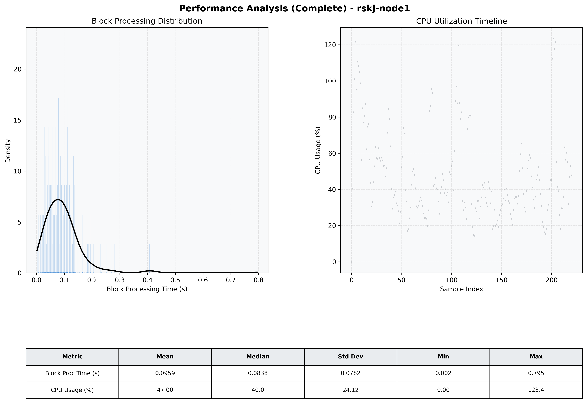

# Node1 Quantitative Performance Report

| Category | Metric | Unit | Mean | Median | Min | Max |
| :--- | :--- | :--- | :--- | :--- | :--- | :--- |
| Processing | Block Processing Time | s | 0.096 | 0.084 | 0.002 | 0.795 |
|  | BlockExecution JMX | s | 0.077 | 0.066 | 0.000 | 0.808 |
| | Gas Consumed (per block) | M units | 5.98 | 6.44 | 0.00 | 6.94 |
| Resources | CPU Usage per Container | % | 47.00 | 40.04 | 0.00 | 123.44 |
|  | Memory Usage per Container | MiB | 1845.6 | 1873.3 | 296.2 | 2187.3 |
| | CPU & Memory Assigned | - | 1.0 CPU, 4G | - | - | - |
| JVM | JVM Heap Used | MiB | 687.8 | 677.9 | 99.9 | 1249.2 |
| | JVM Heap Allocated | MiB | 2969.6 | 2969.6 | 2969.6 | 2969.6 |
| JVM GC | GC Copy Time | s | 0.0019 | 0.0015 | 0.000 | 0.006 |
| JVM GC | GC MarkSweep Time | s | 0.0000 | 0.0000 | 0.000 | 0.000 |
| Disk I/O | Disk Read | MiB/s | 0.004 | 0.000 | 0.000 | 0.690 |
|  | Disk Write | MiB/s | 81.335 | 22.207 | 0.000 | 3236.966 |
| Network | Received Network Traffic per Container | KiB/s | 129.86 | 121.48 | 0.00 | 357.06 |
|  | Sent Network Traffic per Container | KiB/s | 107.19 | 92.24 | 0.00 | 289.88 |

