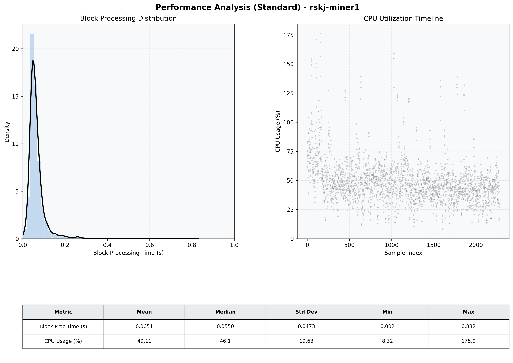

# Miner1 Quantitative Performance Report

| Category | Metric | Unit | Mean | Median | Min | Max |
| :--- | :--- | :--- | :--- | :--- | :--- | :--- |
| Processing | Block Processing Time | s | 0.065 | 0.055 | 0.002 | 0.832 |
|  | BlockExecution JMX | s | 0.036 | 0.028 | 0.003 | 0.992 |
| | Gas Consumed (per block) | M units | 8.74 | 8.91 | 0.00 | 9.01 |
| Resources | CPU Usage per Container | % | 49.11 | 46.13 | 8.32 | 175.93 |
|  | Memory Usage per Container | MiB | 3129.9 | 3423.6 | 602.8 | 4095.6 |
| JVM | JVM Heap Used | MiB | 1309.8 | 1211.6 | 72.1 | 2848.8 |
| | JVM Heap Allocated | MiB | 2969.6 | 2969.6 | 2969.6 | 2969.6 |
| JVM GC | GC Copy Time | s | 0.0021 | 0.0017 | 0.000 | 0.023 |
| JVM GC | GC MarkSweep Time | s | 0.0001 | 0.0000 | 0.000 | 0.325 |
| Disk I/O | Disk Read | MiB/s | 11.699 | 0.000 | 0.000 | 11980.273 |
|  | Disk Write | MiB/s | 213.885 | 148.966 | 0.000 | 23934.060 |
| Network | Received Network Traffic per Container | KiB/s | 36.11 | 42.49 | 0.00 | 45.99 |
|  | Sent Network Traffic per Container | KiB/s | 41.34 | 45.81 | 0.00 | 55.28 |

