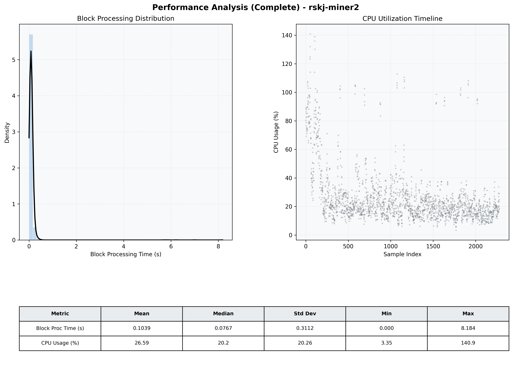

# Miner2 Quantitative Performance Report

| Category | Metric | Unit | Mean | Median | Min | Max |
| :--- | :--- | :--- | :--- | :--- | :--- | :--- |
| Processing | Block Processing Time | s | 0.104 | 0.077 | 0.000 | 8.184 |
|  | BlockExecution JMX | s | 0.059 | 0.042 | 0.003 | 6.926 |
| | Gas Consumed (per block) | M units | 8.74 | 8.91 | 0.00 | 9.01 |
| Resources | CPU Usage per Container | % | 26.59 | 20.19 | 3.35 | 140.90 |
|  | Memory Usage per Container | MiB | 1651.3 | 1790.8 | 1296.7 | 1937.6 |
| JVM | JVM Heap Used | MiB | 1326.2 | 1244.6 | 108.8 | 2836.5 |
| | JVM Heap Allocated | MiB | 2969.6 | 2969.6 | 2969.6 | 2969.6 |
| JVM GC | GC Copy Time | s | 0.0019 | 0.0015 | 0.000 | 0.023 |
| JVM GC | GC MarkSweep Time | s | 0.0001 | 0.0000 | 0.000 | 0.287 |
| Disk I/O | Disk Read | MiB/s | 2.650 | 0.000 | 0.000 | 3338.441 |
|  | Disk Write | MiB/s | 54.440 | 10.069 | 0.000 | 19411.014 |
| Network | Received Network Traffic per Container | KiB/s | 3.03 | 1.86 | 0.00 | 10.93 |
|  | Sent Network Traffic per Container | KiB/s | 11.70 | 10.78 | 0.00 | 18.79 |

