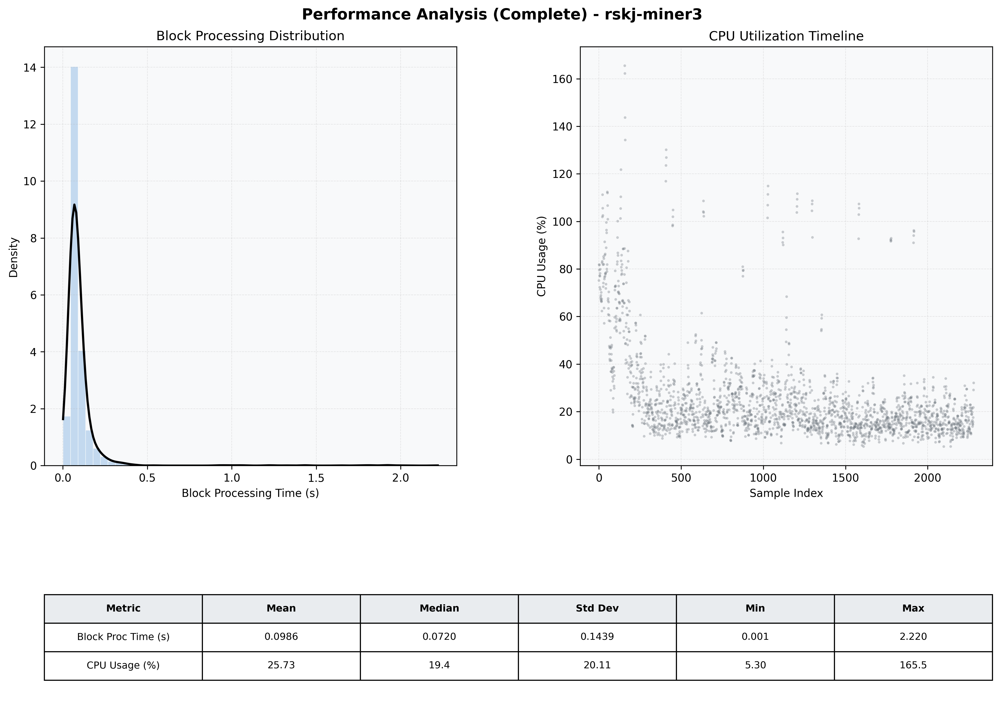

# Miner3 Quantitative Performance Report

| Category | Metric | Unit | Mean | Median | Min | Max |
| :--- | :--- | :--- | :--- | :--- | :--- | :--- |
| Processing | Block Processing Time | s | 0.099 | 0.072 | 0.001 | 2.220 |
|  | BlockExecution JMX | s | 0.064 | 0.039 | 0.003 | 2.122 |
| | Gas Consumed (per block) | M units | 8.74 | 8.91 | 0.00 | 9.01 |
| Resources | CPU Usage per Container | % | 25.73 | 19.43 | 5.30 | 165.47 |
|  | Memory Usage per Container | MiB | 3062.1 | 3318.8 | 473.9 | 4054.7 |
| JVM | JVM Heap Used | MiB | 1325.4 | 1216.4 | 58.3 | 2844.1 |
| | JVM Heap Allocated | MiB | 2969.6 | 2969.6 | 2969.6 | 2969.6 |
| JVM GC | GC Copy Time | s | 0.0021 | 0.0018 | 0.000 | 0.018 |
| JVM GC | GC MarkSweep Time | s | 0.0002 | 0.0000 | 0.000 | 0.269 |
| Disk I/O | Disk Read | MiB/s | 5.528 | 0.000 | 0.000 | 4918.069 |
|  | Disk Write | MiB/s | 101.603 | 10.345 | 0.000 | 23764.268 |
| Network | Received Network Traffic per Container | KiB/s | 3.02 | 1.84 | 0.00 | 10.93 |
|  | Sent Network Traffic per Container | KiB/s | 11.68 | 10.78 | 0.00 | 18.60 |

