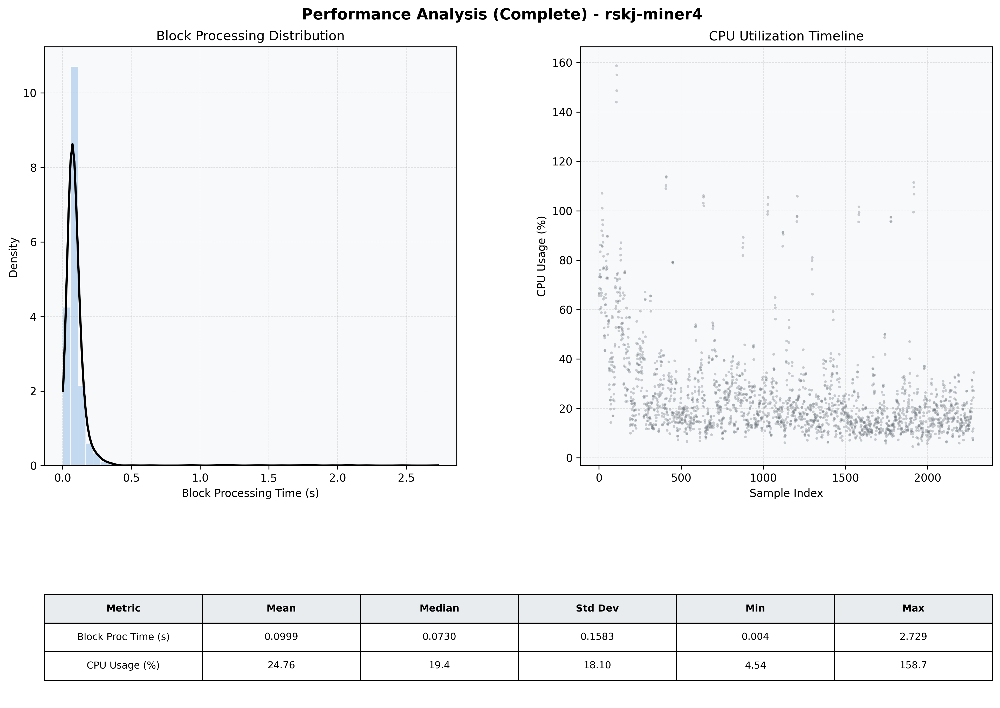

# Miner4 Quantitative Performance Report

| Category | Metric | Unit | Mean | Median | Min | Max |
| :--- | :--- | :--- | :--- | :--- | :--- | :--- |
| Processing | Block Processing Time | s | 0.100 | 0.073 | 0.004 | 2.729 |
|  | BlockExecution JMX | s | 0.063 | 0.039 | 0.002 | 2.703 |
| | Gas Consumed (per block) | M units | 8.74 | 8.91 | 0.00 | 9.01 |
| Resources | CPU Usage per Container | % | 24.76 | 19.35 | 4.54 | 158.70 |
|  | Memory Usage per Container | MiB | 1698.3 | 1685.6 | 1376.6 | 1975.9 |
| JVM | JVM Heap Used | MiB | 1325.2 | 1220.2 | 76.0 | 2847.5 |
| | JVM Heap Allocated | MiB | 2969.6 | 2969.6 | 2969.6 | 2969.6 |
| JVM GC | GC Copy Time | s | 0.0020 | 0.0017 | 0.000 | 0.013 |
| JVM GC | GC MarkSweep Time | s | 0.0002 | 0.0000 | 0.000 | 0.347 |
| Disk I/O | Disk Read | MiB/s | 8.685 | 0.000 | 0.000 | 11059.797 |
|  | Disk Write | MiB/s | 101.606 | 10.207 | 0.000 | 23772.958 |
| Network | Received Network Traffic per Container | KiB/s | 3.02 | 1.83 | 0.00 | 10.95 |
|  | Sent Network Traffic per Container | KiB/s | 11.69 | 10.75 | 0.00 | 18.62 |

