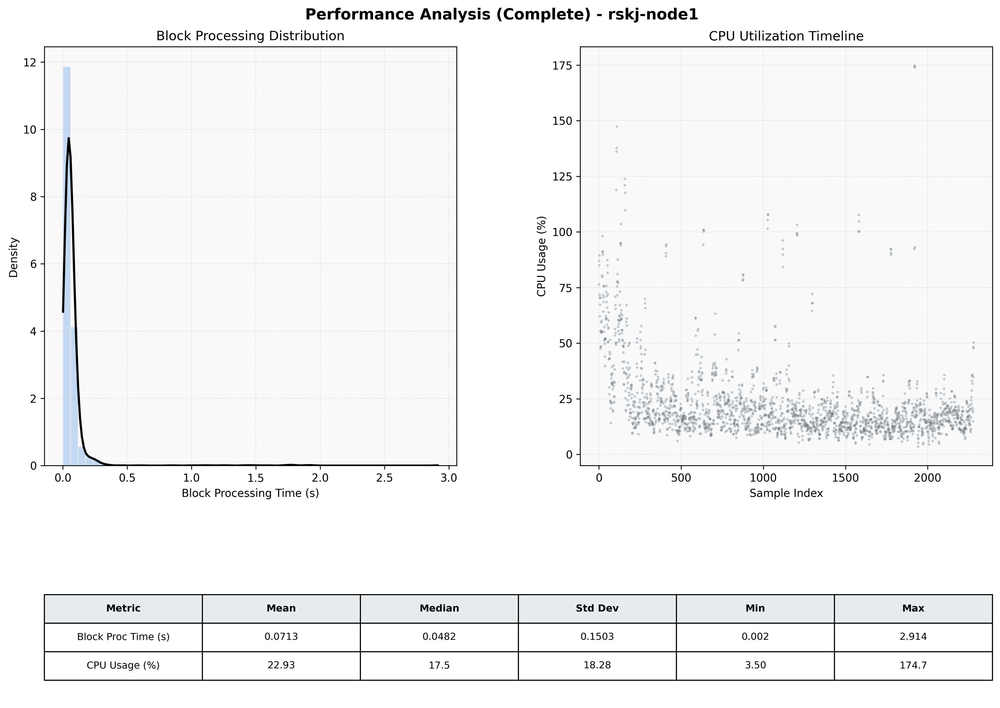

# Node1 Quantitative Performance Report

| Category | Metric | Unit | Mean | Median | Min | Max |
| :--- | :--- | :--- | :--- | :--- | :--- | :--- |
| Processing | Block Processing Time | s | 0.071 | 0.048 | 0.002 | 2.914 |
|  | BlockExecution JMX | s | 0.065 | 0.041 | 0.001 | 3.714 |
| | Gas Consumed (per block) | M units | 8.74 | 8.91 | 0.00 | 9.01 |
| Resources | CPU Usage per Container | % | 22.93 | 17.54 | 3.50 | 174.70 |
|  | Memory Usage per Container | MiB | 1585.1 | 1601.7 | 1331.1 | 1815.0 |
| JVM | JVM Heap Used | MiB | 1334.9 | 1223.6 | 63.9 | 2872.1 |
| | JVM Heap Allocated | MiB | 2969.6 | 2969.6 | 2969.6 | 2969.6 |
| JVM GC | GC Copy Time | s | 0.0021 | 0.0018 | 0.000 | 0.010 |
| JVM GC | GC MarkSweep Time | s | 0.0002 | 0.0000 | 0.000 | 0.345 |
| Disk I/O | Disk Read | MiB/s | 5.697 | 0.000 | 0.000 | 7209.379 |
|  | Disk Write | MiB/s | 91.370 | 1.379 | 0.000 | 23759.302 |
| Network | Received Network Traffic per Container | KiB/s | 3.00 | 1.84 | 0.00 | 10.70 |
|  | Sent Network Traffic per Container | KiB/s | 11.57 | 10.60 | 0.00 | 18.40 |

