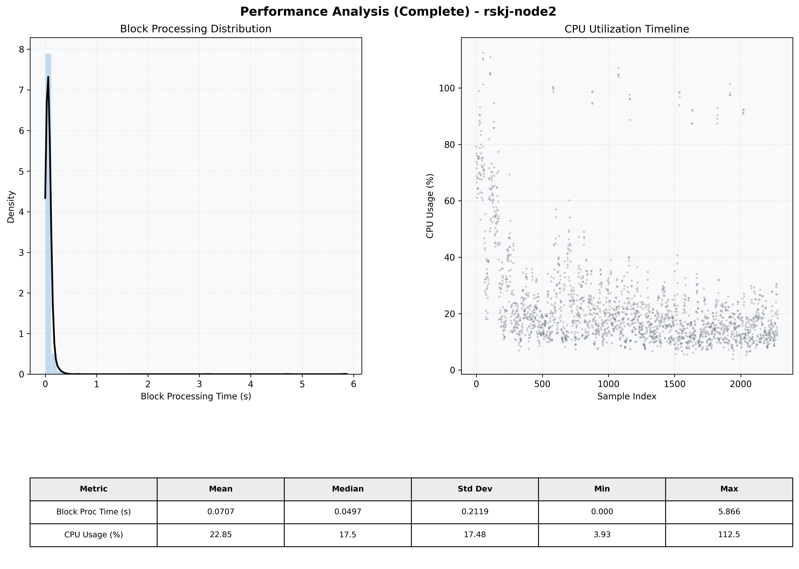

# Node2 Quantitative Performance Report

| Category | Metric | Unit | Mean | Median | Min | Max |
| :--- | :--- | :--- | :--- | :--- | :--- | :--- |
| Processing | Block Processing Time | s | 0.071 | 0.050 | 0.000 | 5.866 |
|  | BlockExecution JMX | s | 0.067 | 0.045 | 0.001 | 7.543 |
| | Gas Consumed (per block) | M units | 8.74 | 8.91 | 0.00 | 9.01 |
| Resources | CPU Usage per Container | % | 22.85 | 17.51 | 3.93 | 112.49 |
|  | Memory Usage per Container | MiB | 3032.8 | 3225.6 | 470.6 | 4096.0 |
| JVM | JVM Heap Used | MiB | 1328.4 | 1242.0 | 58.2 | 2839.6 |
| | JVM Heap Allocated | MiB | 2969.6 | 2969.6 | 2969.6 | 2969.6 |
| JVM GC | GC Copy Time | s | 0.0018 | 0.0014 | 0.000 | 0.014 |
| JVM GC | GC MarkSweep Time | s | 0.0002 | 0.0000 | 0.000 | 0.366 |
| Disk I/O | Disk Read | MiB/s | 0.037 | 0.000 | 0.000 | 62.696 |
|  | Disk Write | MiB/s | 44.154 | 1.241 | 0.000 | 15839.724 |
| Network | Received Network Traffic per Container | KiB/s | 3.05 | 1.86 | 0.00 | 11.01 |
|  | Sent Network Traffic per Container | KiB/s | 11.51 | 10.55 | 0.00 | 18.25 |

