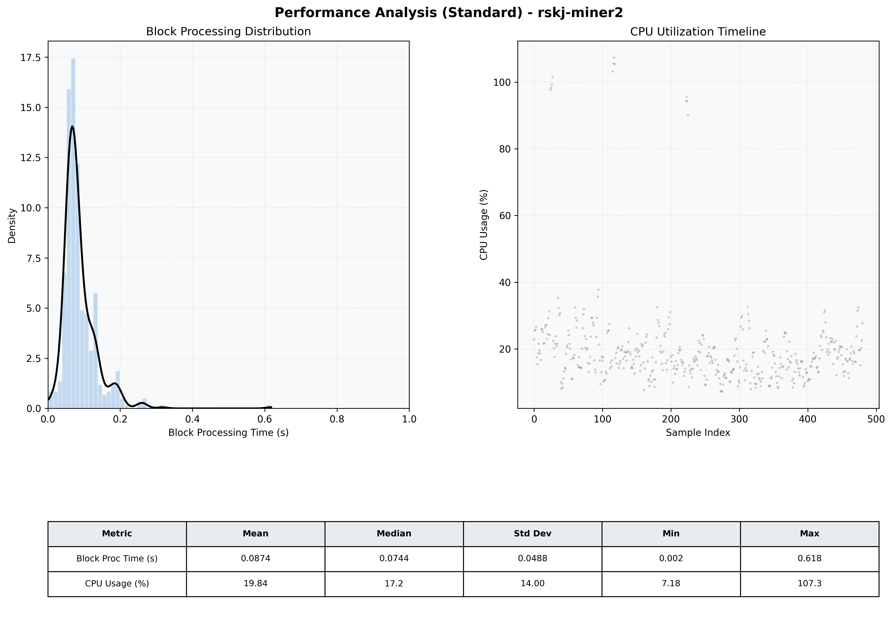

# Miner2 Quantitative Performance Report

| Category | Metric | Unit | Mean | Median | Min | Max |
| :--- | :--- | :--- | :--- | :--- | :--- | :--- |
| Processing | Block Processing Time | s | 0.087 | 0.074 | 0.002 | 0.618 |
|  | BlockExecution JMX | s | 0.047 | 0.039 | 0.003 | 0.250 |
| | Gas Consumed (per block) | M units | 8.72 | 8.91 | 0.00 | 9.01 |
| Resources | CPU Usage per Container | % | 19.84 | 17.15 | 7.18 | 107.31 |
|  | Memory Usage per Container | MiB | 3809.2 | 3900.6 | 3497.4 | 4057.2 |
| JVM | JVM Heap Used | MiB | 1370.7 | 1169.2 | 436.0 | 2840.7 |
| | JVM Heap Allocated | MiB | 2969.6 | 2969.6 | 2969.6 | 2969.6 |
| JVM GC | GC Copy Time | s | 0.0017 | 0.0013 | 0.000 | 0.017 |
| JVM GC | GC MarkSweep Time | s | 0.0006 | 0.0000 | 0.000 | 0.287 |
| Disk I/O | Disk Read | MiB/s | 1.682 | 0.000 | 0.000 | 718.734 |
|  | Disk Write | MiB/s | 46.144 | 9.379 | 0.552 | 6749.793 |
| Network | Received Network Traffic per Container | KiB/s | 2.90 | 1.78 | 1.20 | 10.63 |
|  | Sent Network Traffic per Container | KiB/s | 11.61 | 10.71 | 6.14 | 18.79 |

