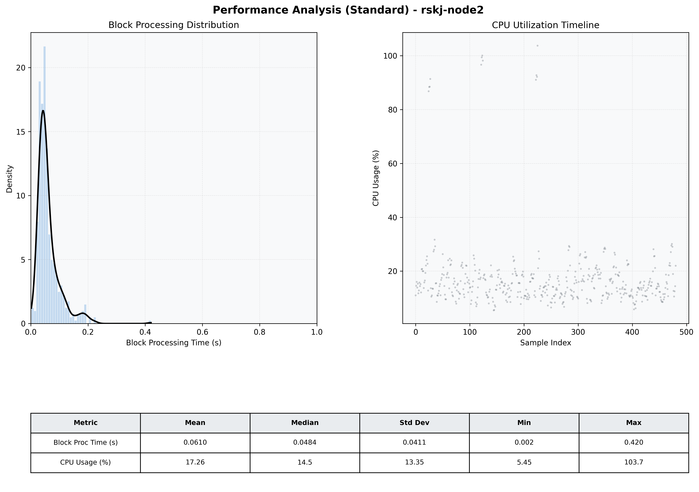

# Node2 Quantitative Performance Report

| Category | Metric | Unit | Mean | Median | Min | Max |
| :--- | :--- | :--- | :--- | :--- | :--- | :--- |
| Processing | Block Processing Time | s | 0.061 | 0.048 | 0.002 | 0.420 |
|  | BlockExecution JMX | s | 0.053 | 0.042 | 0.001 | 0.414 |
| | Gas Consumed (per block) | M units | 8.72 | 8.91 | 0.00 | 9.01 |
| Resources | CPU Usage per Container | % | 17.26 | 14.50 | 5.45 | 103.73 |
|  | Memory Usage per Container | MiB | 3983.3 | 3930.5 | 3898.8 | 4095.9 |
| JVM | JVM Heap Used | MiB | 1409.9 | 1228.9 | 465.6 | 2874.6 |
| | JVM Heap Allocated | MiB | 2969.6 | 2969.6 | 2969.6 | 2969.6 |
| JVM GC | GC Copy Time | s | 0.0017 | 0.0012 | 0.000 | 0.014 |
| JVM GC | GC MarkSweep Time | s | 0.0008 | 0.0000 | 0.000 | 0.366 |
| Disk I/O | Disk Read | MiB/s | 0.017 | 0.000 | 0.000 | 1.241 |
|  | Disk Write | MiB/s | 36.476 | 1.241 | 0.000 | 6748.690 |
| Network | Received Network Traffic per Container | KiB/s | 2.92 | 1.79 | 1.07 | 10.84 |
|  | Sent Network Traffic per Container | KiB/s | 11.42 | 10.51 | 3.42 | 18.22 |

