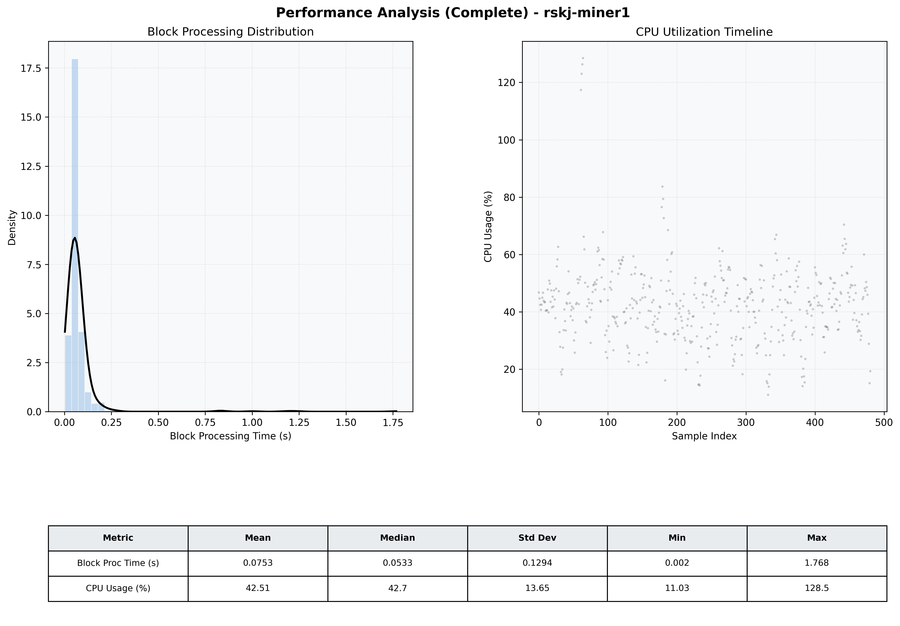

# Miner1 Quantitative Performance Report

| Category | Metric | Unit | Mean | Median | Min | Max |
| :--- | :--- | :--- | :--- | :--- | :--- | :--- |
| Processing | Block Processing Time | s | 0.075 | 0.053 | 0.002 | 1.768 |
|  | BlockExecution JMX | s | 0.043 | 0.027 | 0.003 | 1.199 |
| | Gas Consumed (per block) | M units | 8.72 | 8.91 | 0.00 | 9.01 |
| Resources | CPU Usage per Container | % | 42.51 | 42.71 | 11.03 | 128.48 |
|  | Memory Usage per Container | MiB | 3907.9 | 3907.9 | 3723.7 | 4045.3 |
| JVM | JVM Heap Used | MiB | 1190.4 | 1077.1 | 427.9 | 2812.0 |
| | JVM Heap Allocated | MiB | 2969.6 | 2969.6 | 2969.6 | 2969.6 |
| JVM GC | GC Copy Time | s | 0.0020 | 0.0018 | 0.000 | 0.017 |
| JVM GC | GC MarkSweep Time | s | 0.0013 | 0.0000 | 0.000 | 0.325 |
| Disk I/O | Disk Read | MiB/s | 23.226 | 0.000 | 0.000 | 5528.276 |
|  | Disk Write | MiB/s | 215.414 | 148.690 | 0.000 | 21691.703 |
| Network | Received Network Traffic per Container | KiB/s | 34.76 | 42.46 | 1.52 | 44.93 |
|  | Sent Network Traffic per Container | KiB/s | 40.14 | 45.77 | 10.33 | 53.85 |

