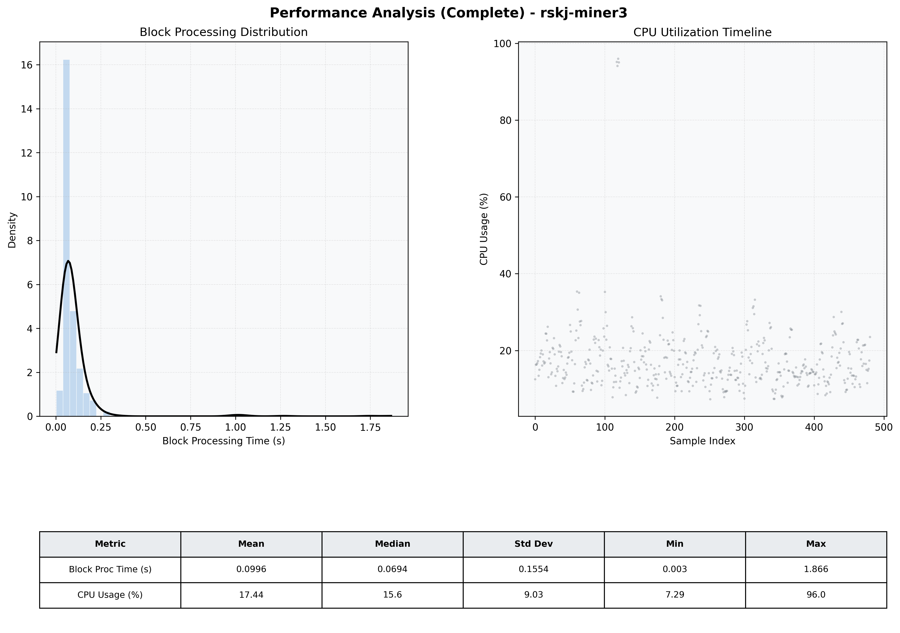

# Miner3 Quantitative Performance Report

| Category | Metric | Unit | Mean | Median | Min | Max |
| :--- | :--- | :--- | :--- | :--- | :--- | :--- |
| Processing | Block Processing Time | s | 0.100 | 0.069 | 0.003 | 1.866 |
|  | BlockExecution JMX | s | 0.063 | 0.036 | 0.003 | 1.811 |
| | Gas Consumed (per block) | M units | 8.72 | 8.91 | 0.00 | 9.01 |
| Resources | CPU Usage per Container | % | 17.44 | 15.60 | 7.29 | 96.01 |
|  | Memory Usage per Container | MiB | 3935.3 | 3924.1 | 3848.0 | 4054.8 |
| JVM | JVM Heap Used | MiB | 1346.7 | 1136.5 | 411.6 | 2887.9 |
| | JVM Heap Allocated | MiB | 2969.6 | 2969.6 | 2969.6 | 2969.6 |
| JVM GC | GC Copy Time | s | 0.0019 | 0.0016 | 0.000 | 0.011 |
| JVM GC | GC MarkSweep Time | s | 0.0006 | 0.0000 | 0.000 | 0.269 |
| Disk I/O | Disk Read | MiB/s | 17.737 | 0.000 | 0.000 | 4917.931 |
|  | Disk Write | MiB/s | 106.306 | 9.518 | 0.552 | 21596.248 |
| Network | Received Network Traffic per Container | KiB/s | 2.89 | 1.75 | 1.17 | 10.88 |
|  | Sent Network Traffic per Container | KiB/s | 11.57 | 10.67 | 7.96 | 18.29 |

