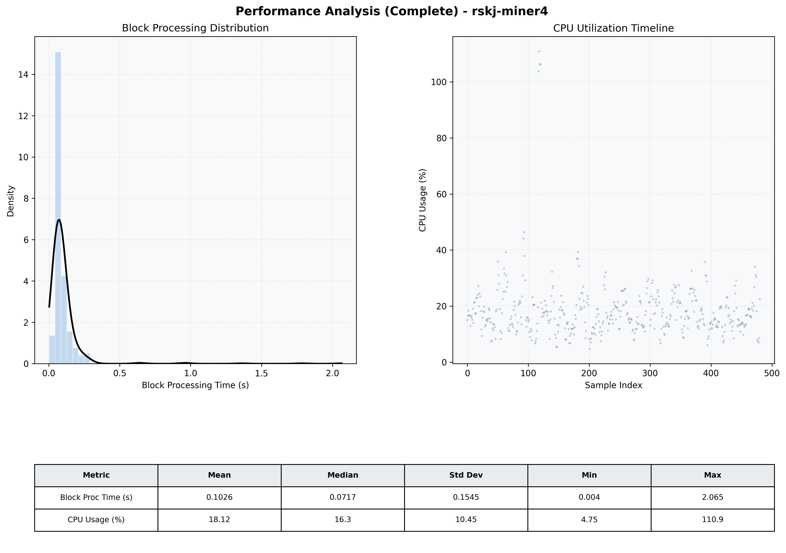

# Miner4 Quantitative Performance Report

| Category | Metric | Unit | Mean | Median | Min | Max |
| :--- | :--- | :--- | :--- | :--- | :--- | :--- |
| Processing | Block Processing Time | s | 0.103 | 0.072 | 0.004 | 2.065 |
|  | BlockExecution JMX | s | 0.073 | 0.038 | 0.003 | 3.858 |
| | Gas Consumed (per block) | M units | 8.72 | 8.91 | 0.00 | 9.01 |
| Resources | CPU Usage per Container | % | 18.12 | 16.34 | 4.75 | 110.89 |
|  | Memory Usage per Container | MiB | 3868.9 | 3884.9 | 3674.9 | 4091.0 |
| JVM | JVM Heap Used | MiB | 1335.3 | 1136.3 | 429.9 | 2857.7 |
| | JVM Heap Allocated | MiB | 2969.6 | 2969.6 | 2969.6 | 2969.6 |
| JVM GC | GC Copy Time | s | 0.0019 | 0.0017 | 0.000 | 0.013 |
| JVM GC | GC MarkSweep Time | s | 0.0007 | 0.0000 | 0.000 | 0.347 |
| Disk I/O | Disk Read | MiB/s | 33.865 | 0.000 | 0.000 | 11056.349 |
|  | Disk Write | MiB/s | 106.219 | 9.380 | 0.552 | 21607.283 |
| Network | Received Network Traffic per Container | KiB/s | 2.90 | 1.76 | 1.17 | 10.97 |
|  | Sent Network Traffic per Container | KiB/s | 11.57 | 10.67 | 6.11 | 18.33 |

