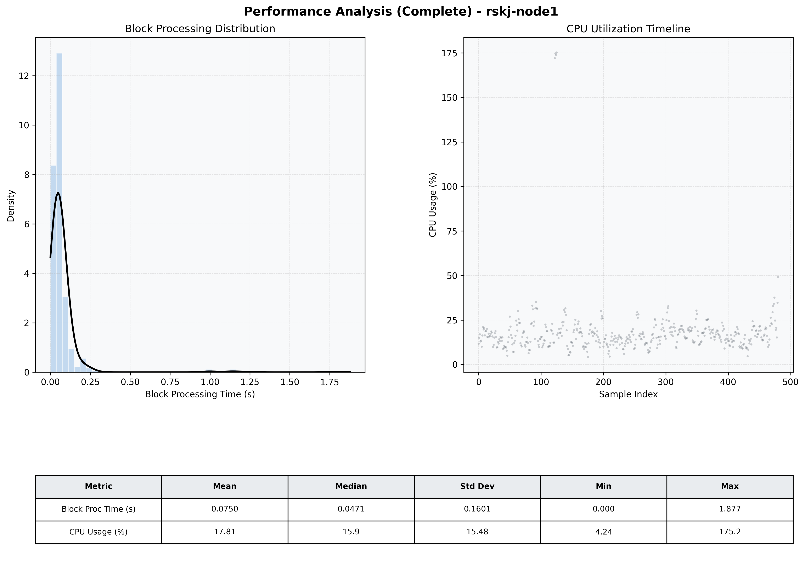

# Node1 Quantitative Performance Report

| Category | Metric | Unit | Mean | Median | Min | Max |
| :--- | :--- | :--- | :--- | :--- | :--- | :--- |
| Processing | Block Processing Time | s | 0.075 | 0.047 | 0.000 | 1.877 |
|  | BlockExecution JMX | s | 0.070 | 0.039 | 0.001 | 3.516 |
| | Gas Consumed (per block) | M units | 8.72 | 8.91 | 0.00 | 9.01 |
| Resources | CPU Usage per Container | % | 17.81 | 15.86 | 4.24 | 175.19 |
|  | Memory Usage per Container | MiB | 3784.9 | 3779.3 | 3462.2 | 4035.3 |
| JVM | JVM Heap Used | MiB | 1363.6 | 1167.1 | 409.7 | 2888.3 |
| | JVM Heap Allocated | MiB | 2969.6 | 2969.6 | 2969.6 | 2969.6 |
| JVM GC | GC Copy Time | s | 0.0018 | 0.0017 | 0.000 | 0.007 |
| JVM GC | GC MarkSweep Time | s | 0.0014 | 0.0000 | 0.000 | 0.345 |
| Disk I/O | Disk Read | MiB/s | 23.198 | 0.000 | 0.000 | 7209.103 |
|  | Disk Write | MiB/s | 96.734 | 1.241 | 0.000 | 21584.247 |
| Network | Received Network Traffic per Container | KiB/s | 2.87 | 1.76 | 1.18 | 10.68 |
|  | Sent Network Traffic per Container | KiB/s | 11.48 | 10.53 | 4.12 | 18.33 |

