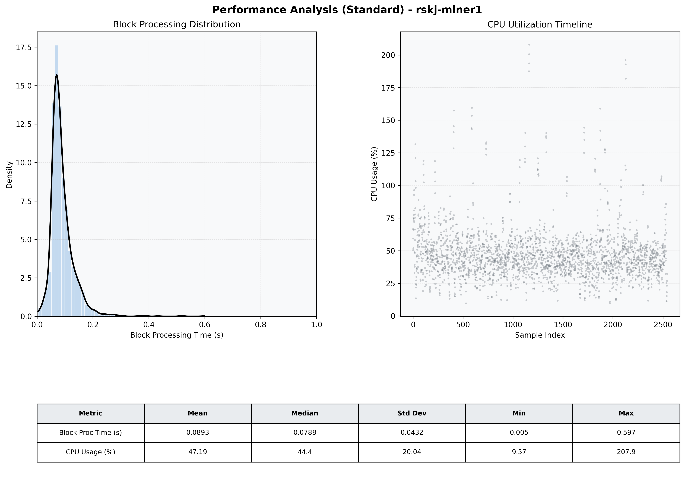

# Miner1 Quantitative Performance Report

| Category | Metric | Unit | Mean | Median | Min | Max |
| :--- | :--- | :--- | :--- | :--- | :--- | :--- |
| Processing | Block Processing Time | s | 0.089 | 0.079 | 0.005 | 0.597 |
|  | BlockExecution JMX | s | 0.048 | 0.041 | 0.002 | 0.773 |
| | Gas Consumed (per block) | M units | 14.89 | 15.14 | 0.00 | 15.25 |
| Resources | CPU Usage per Container | % | 47.19 | 44.44 | 9.57 | 207.87 |
|  | Memory Usage per Container | MiB | 3533.8 | 3897.4 | 1175.2 | 4095.9 |
| JVM | JVM Heap Used | MiB | 1522.1 | 1518.6 | 102.7 | 2827.1 |
| | JVM Heap Allocated | MiB | 2969.6 | 2969.6 | 2969.6 | 2969.6 |
| JVM GC | GC Copy Time | s | 0.0029 | 0.0024 | 0.000 | 0.048 |
| JVM GC | GC MarkSweep Time | s | 0.0002 | 0.0000 | 0.000 | 0.318 |
| Disk I/O | Disk Read | MiB/s | 86.324 | 0.000 | 0.000 | 35327.977 |
|  | Disk Write | MiB/s | 314.884 | 148.552 | 0.000 | 46840.512 |
| Network | Received Network Traffic per Container | KiB/s | 36.64 | 42.58 | 1.44 | 45.59 |
|  | Sent Network Traffic per Container | KiB/s | 41.78 | 45.89 | 6.43 | 55.13 |

