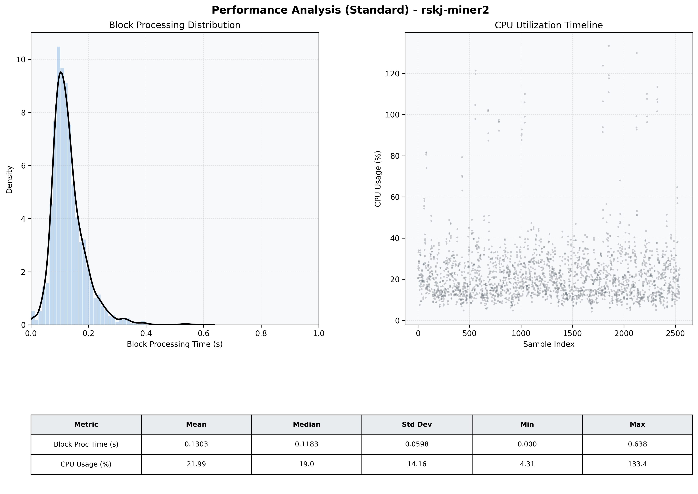

# Miner2 Quantitative Performance Report

| Category | Metric | Unit | Mean | Median | Min | Max |
| :--- | :--- | :--- | :--- | :--- | :--- | :--- |
| Processing | Block Processing Time | s | 0.130 | 0.118 | 0.000 | 0.638 |
|  | BlockExecution JMX | s | 0.074 | 0.062 | 0.002 | 0.471 |
| | Gas Consumed (per block) | M units | 14.89 | 15.14 | 0.00 | 15.25 |
| Resources | CPU Usage per Container | % | 21.99 | 18.99 | 4.31 | 133.38 |
|  | Memory Usage per Container | MiB | 3537.8 | 3880.1 | 1189.2 | 4096.0 |
| JVM | JVM Heap Used | MiB | 1563.4 | 1559.1 | 81.9 | 2870.2 |
| | JVM Heap Allocated | MiB | 2969.6 | 2969.6 | 2969.6 | 2969.6 |
| JVM GC | GC Copy Time | s | 0.0025 | 0.0021 | 0.000 | 0.032 |
| JVM GC | GC MarkSweep Time | s | 0.0003 | 0.0000 | 0.000 | 0.436 |
| Disk I/O | Disk Read | MiB/s | 64.036 | 0.000 | 0.000 | 47648.540 |
|  | Disk Write | MiB/s | 145.069 | 10.069 | 0.000 | 53145.005 |
| Network | Received Network Traffic per Container | KiB/s | 3.03 | 1.94 | 1.10 | 11.00 |
|  | Sent Network Traffic per Container | KiB/s | 11.70 | 10.85 | 7.83 | 19.00 |

