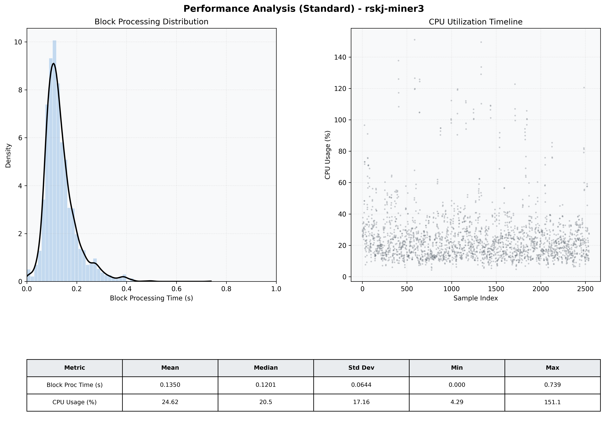

# Miner3 Quantitative Performance Report

| Category | Metric | Unit | Mean | Median | Min | Max |
| :--- | :--- | :--- | :--- | :--- | :--- | :--- |
| Processing | Block Processing Time | s | 0.135 | 0.120 | 0.000 | 0.739 |
|  | BlockExecution JMX | s | 0.076 | 0.062 | 0.004 | 0.433 |
| | Gas Consumed (per block) | M units | 14.89 | 15.14 | 0.00 | 15.25 |
| Resources | CPU Usage per Container | % | 24.62 | 20.46 | 4.29 | 151.06 |
|  | Memory Usage per Container | MiB | 3489.3 | 3797.7 | 1162.0 | 4095.8 |
| JVM | JVM Heap Used | MiB | 1510.3 | 1500.9 | 127.8 | 2881.3 |
| | JVM Heap Allocated | MiB | 2969.6 | 2969.6 | 2969.6 | 2969.6 |
| JVM GC | GC Copy Time | s | 0.0031 | 0.0026 | 0.000 | 0.033 |
| JVM GC | GC MarkSweep Time | s | 0.0005 | 0.0000 | 0.000 | 0.303 |
| Disk I/O | Disk Read | MiB/s | 85.091 | 0.000 | 0.000 | 34684.138 |
|  | Disk Write | MiB/s | 202.362 | 10.206 | 0.276 | 44947.927 |
| Network | Received Network Traffic per Container | KiB/s | 3.02 | 1.92 | 1.15 | 10.97 |
|  | Sent Network Traffic per Container | KiB/s | 11.71 | 10.85 | 5.42 | 18.49 |

