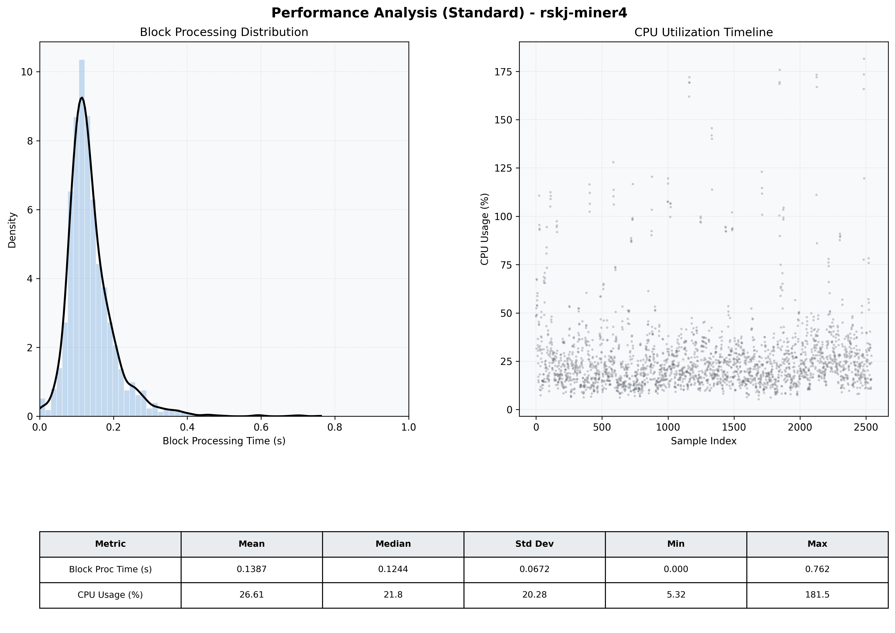

# Miner4 Quantitative Performance Report

| Category | Metric | Unit | Mean | Median | Min | Max |
| :--- | :--- | :--- | :--- | :--- | :--- | :--- |
| Processing | Block Processing Time | s | 0.139 | 0.124 | 0.000 | 0.762 |
|  | BlockExecution JMX | s | 0.080 | 0.066 | 0.002 | 0.545 |
| | Gas Consumed (per block) | M units | 14.89 | 15.14 | 0.00 | 15.25 |
| Resources | CPU Usage per Container | % | 26.61 | 21.81 | 5.32 | 181.51 |
|  | Memory Usage per Container | MiB | 3486.7 | 3812.3 | 1164.2 | 4095.9 |
| JVM | JVM Heap Used | MiB | 1517.0 | 1526.6 | 73.4 | 2863.5 |
| | JVM Heap Allocated | MiB | 2969.6 | 2969.6 | 2969.6 | 2969.6 |
| JVM GC | GC Copy Time | s | 0.0030 | 0.0026 | 0.000 | 0.030 |
| JVM GC | GC MarkSweep Time | s | 0.0004 | 0.0000 | 0.000 | 0.360 |
| Disk I/O | Disk Read | MiB/s | 82.816 | 0.000 | 0.000 | 32273.536 |
|  | Disk Write | MiB/s | 207.060 | 10.069 | 0.000 | 43578.454 |
| Network | Received Network Traffic per Container | KiB/s | 3.02 | 1.93 | 1.12 | 10.91 |
|  | Sent Network Traffic per Container | KiB/s | 11.70 | 10.87 | 5.04 | 18.71 |

