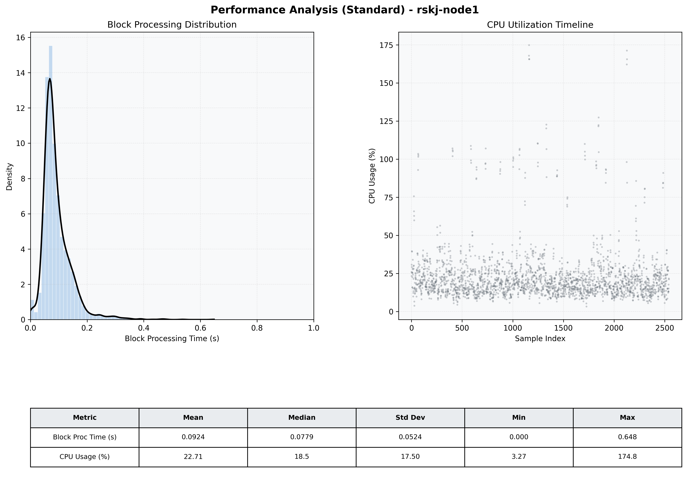

# Node1 Quantitative Performance Report

| Category | Metric | Unit | Mean | Median | Min | Max |
| :--- | :--- | :--- | :--- | :--- | :--- | :--- |
| Processing | Block Processing Time | s | 0.092 | 0.078 | 0.000 | 0.648 |
|  | BlockExecution JMX | s | 0.085 | 0.072 | 0.001 | 0.520 |
| | Gas Consumed (per block) | M units | 14.89 | 15.14 | 0.00 | 15.25 |
| Resources | CPU Usage per Container | % | 22.71 | 18.54 | 3.27 | 174.79 |
|  | Memory Usage per Container | MiB | 3451.3 | 3776.6 | 1166.4 | 4096.0 |
| JVM | JVM Heap Used | MiB | 1512.9 | 1504.9 | 103.4 | 2851.0 |
| | JVM Heap Allocated | MiB | 2969.6 | 2969.6 | 2969.6 | 2969.6 |
| JVM GC | GC Copy Time | s | 0.0030 | 0.0025 | 0.000 | 0.043 |
| JVM GC | GC MarkSweep Time | s | 0.0003 | 0.0000 | 0.000 | 0.373 |
| Disk I/O | Disk Read | MiB/s | 82.555 | 0.000 | 0.000 | 32549.655 |
|  | Disk Write | MiB/s | 194.204 | 1.379 | 0.000 | 37144.769 |
| Network | Received Network Traffic per Container | KiB/s | 3.02 | 1.93 | 1.05 | 10.74 |
|  | Sent Network Traffic per Container | KiB/s | 11.57 | 10.68 | 3.63 | 18.39 |

