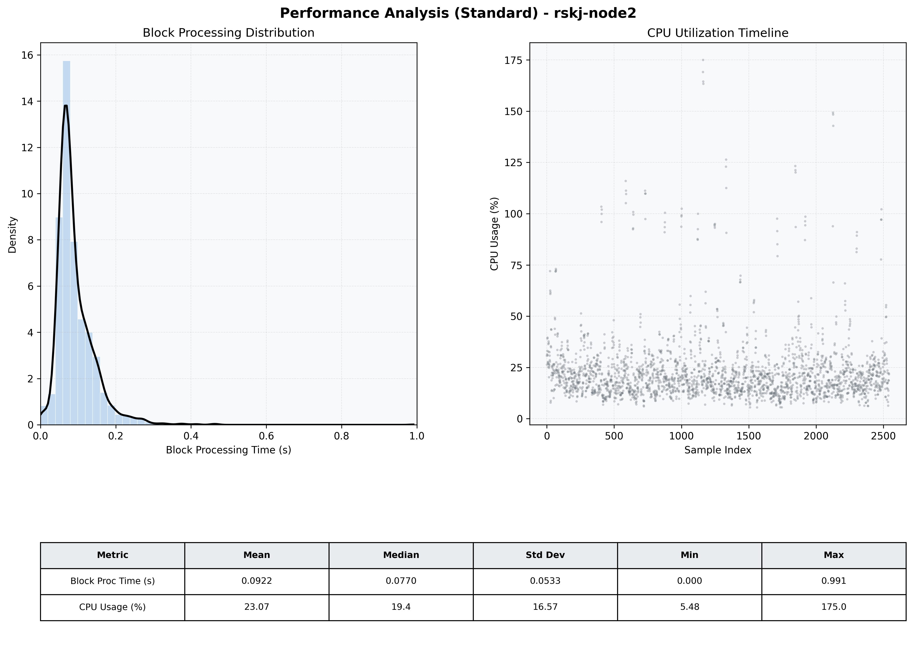

# Node2 Quantitative Performance Report

| Category | Metric | Unit | Mean | Median | Min | Max |
| :--- | :--- | :--- | :--- | :--- | :--- | :--- |
| Processing | Block Processing Time | s | 0.092 | 0.077 | 0.000 | 0.991 |
|  | BlockExecution JMX | s | 0.085 | 0.071 | 0.001 | 0.686 |
| | Gas Consumed (per block) | M units | 14.89 | 15.14 | 0.00 | 15.25 |
| Resources | CPU Usage per Container | % | 23.07 | 19.45 | 5.48 | 174.97 |
|  | Memory Usage per Container | MiB | 3445.2 | 3767.0 | 1150.3 | 4095.8 |
| JVM | JVM Heap Used | MiB | 1517.3 | 1515.4 | 158.2 | 2884.3 |
| | JVM Heap Allocated | MiB | 2969.6 | 2969.6 | 2969.6 | 2969.6 |
| JVM GC | GC Copy Time | s | 0.0028 | 0.0025 | 0.000 | 0.033 |
| JVM GC | GC MarkSweep Time | s | 0.0002 | 0.0000 | 0.000 | 0.312 |
| Disk I/O | Disk Read | MiB/s | 84.031 | 0.000 | 0.000 | 31501.655 |
|  | Disk Write | MiB/s | 190.504 | 1.379 | 0.000 | 37138.837 |
| Network | Received Network Traffic per Container | KiB/s | 3.02 | 1.93 | 1.15 | 10.77 |
|  | Sent Network Traffic per Container | KiB/s | 11.56 | 10.68 | 7.75 | 18.33 |

