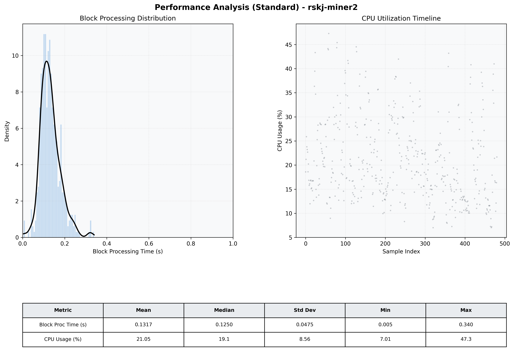

# Miner2 Quantitative Performance Report

| Category | Metric | Unit | Mean | Median | Min | Max |
| :--- | :--- | :--- | :--- | :--- | :--- | :--- |
| Processing | Block Processing Time | s | 0.132 | 0.125 | 0.005 | 0.340 |
|  | BlockExecution JMX | s | 0.071 | 0.062 | 0.002 | 0.461 |
| | Gas Consumed (per block) | M units | 14.90 | 15.14 | 0.00 | 15.25 |
| Resources | CPU Usage per Container | % | 21.05 | 19.13 | 7.01 | 47.28 |
|  | Memory Usage per Container | MiB | 3931.0 | 3904.3 | 3871.5 | 4036.4 |
| JVM | JVM Heap Used | MiB | 1470.5 | 1467.1 | 646.8 | 2323.1 |
| | JVM Heap Allocated | MiB | 2969.6 | 2969.6 | 2969.6 | 2969.6 |
| JVM GC | GC Copy Time | s | 0.0024 | 0.0020 | 0.000 | 0.016 |
| JVM GC | GC MarkSweep Time | s | 0.0000 | 0.0000 | 0.000 | 0.000 |
| Disk I/O | Disk Read | MiB/s | 136.686 | 0.000 | 0.000 | 42024.482 |
|  | Disk Write | MiB/s | 227.050 | 10.069 | 0.000 | 51919.865 |
| Network | Received Network Traffic per Container | KiB/s | 3.03 | 2.03 | 1.10 | 10.91 |
|  | Sent Network Traffic per Container | KiB/s | 11.73 | 11.01 | 9.70 | 18.36 |

