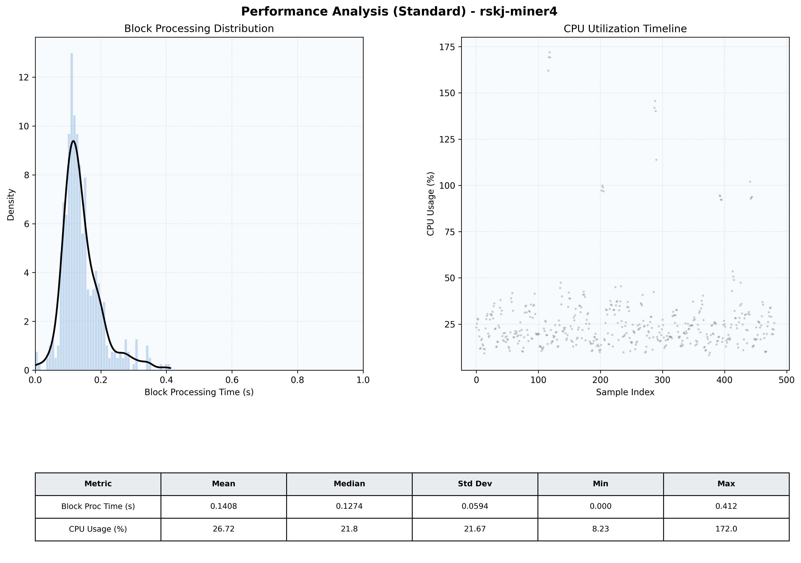

# Miner4 Quantitative Performance Report

| Category | Metric | Unit | Mean | Median | Min | Max |
| :--- | :--- | :--- | :--- | :--- | :--- | :--- |
| Processing | Block Processing Time | s | 0.141 | 0.127 | 0.000 | 0.412 |
|  | BlockExecution JMX | s | 0.077 | 0.065 | 0.002 | 0.336 |
| | Gas Consumed (per block) | M units | 14.90 | 15.14 | 0.00 | 15.25 |
| Resources | CPU Usage per Container | % | 26.72 | 21.77 | 8.23 | 171.96 |
|  | Memory Usage per Container | MiB | 3802.0 | 3809.0 | 3529.9 | 4095.2 |
| JVM | JVM Heap Used | MiB | 1387.7 | 1379.5 | 544.4 | 2229.9 |
| | JVM Heap Allocated | MiB | 2969.6 | 2969.6 | 2969.6 | 2969.6 |
| JVM GC | GC Copy Time | s | 0.0029 | 0.0025 | 0.000 | 0.021 |
| JVM GC | GC MarkSweep Time | s | 0.0000 | 0.0000 | 0.000 | 0.000 |
| Disk I/O | Disk Read | MiB/s | 115.258 | 0.000 | 0.000 | 23469.481 |
|  | Disk Write | MiB/s | 232.731 | 10.207 | 0.552 | 37161.597 |
| Network | Received Network Traffic per Container | KiB/s | 3.01 | 1.98 | 1.15 | 10.74 |
|  | Sent Network Traffic per Container | KiB/s | 11.73 | 10.98 | 9.72 | 18.44 |

