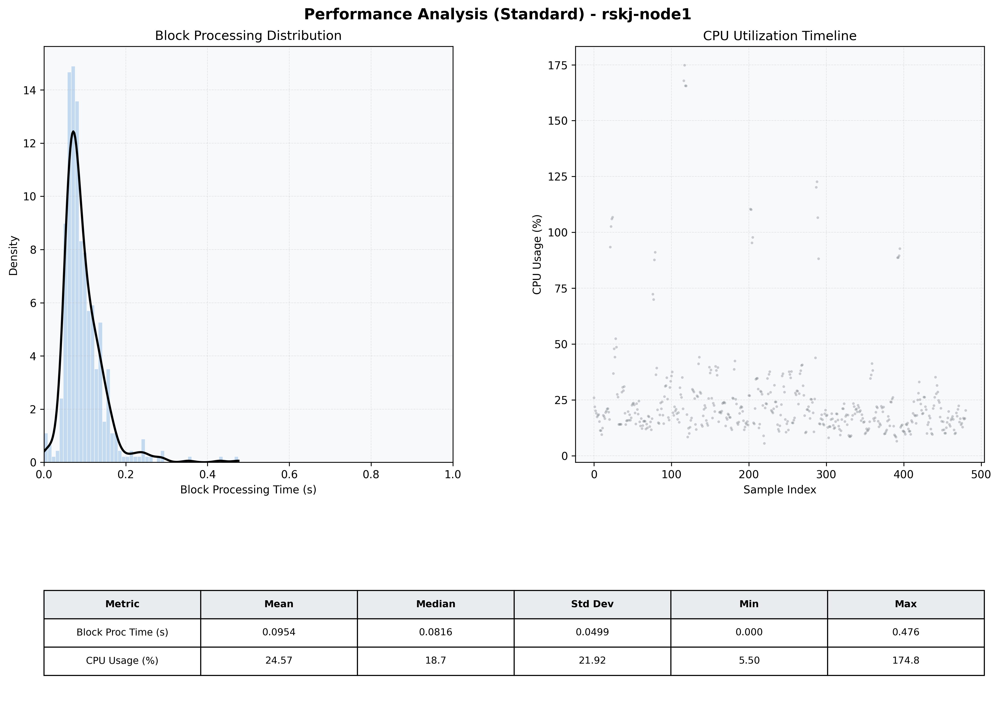

# Node1 Quantitative Performance Report

| Category | Metric | Unit | Mean | Median | Min | Max |
| :--- | :--- | :--- | :--- | :--- | :--- | :--- |
| Processing | Block Processing Time | s | 0.095 | 0.082 | 0.000 | 0.476 |
|  | BlockExecution JMX | s | 0.088 | 0.076 | 0.002 | 0.417 |
| | Gas Consumed (per block) | M units | 14.90 | 15.14 | 0.00 | 15.25 |
| Resources | CPU Usage per Container | % | 24.57 | 18.75 | 5.50 | 174.79 |
|  | Memory Usage per Container | MiB | 3808.6 | 3825.0 | 3550.7 | 4096.0 |
| JVM | JVM Heap Used | MiB | 1375.8 | 1354.2 | 489.5 | 2228.0 |
| | JVM Heap Allocated | MiB | 2969.6 | 2969.6 | 2969.6 | 2969.6 |
| JVM GC | GC Copy Time | s | 0.0029 | 0.0025 | 0.000 | 0.030 |
| JVM GC | GC MarkSweep Time | s | 0.0000 | 0.0000 | 0.000 | 0.000 |
| Disk I/O | Disk Read | MiB/s | 111.301 | 0.000 | 0.000 | 24368.025 |
|  | Disk Write | MiB/s | 222.360 | 1.379 | 0.000 | 37144.769 |
| Network | Received Network Traffic per Container | KiB/s | 3.02 | 2.04 | 1.13 | 10.53 |
|  | Sent Network Traffic per Container | KiB/s | 11.59 | 10.78 | 9.70 | 18.39 |

