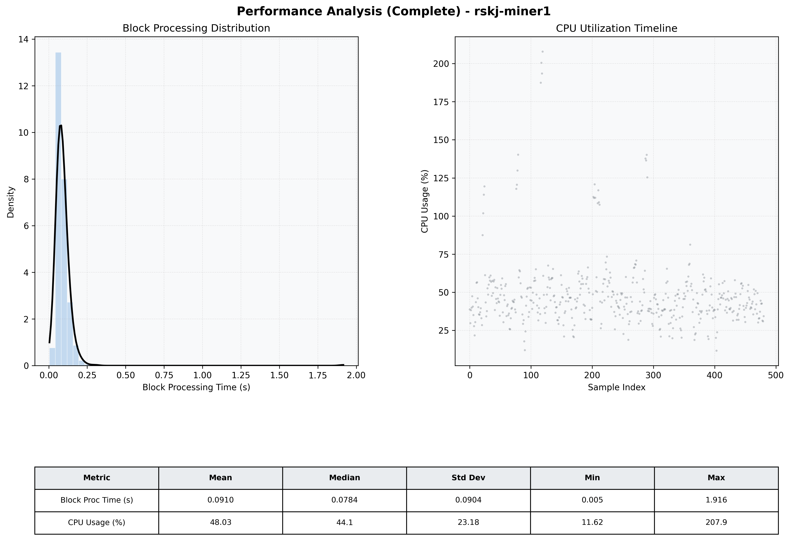

# Miner1 Quantitative Performance Report

| Category | Metric | Unit | Mean | Median | Min | Max |
| :--- | :--- | :--- | :--- | :--- | :--- | :--- |
| Processing | Block Processing Time | s | 0.091 | 0.078 | 0.005 | 1.916 |
|  | BlockExecution JMX | s | 0.048 | 0.040 | 0.003 | 1.839 |
| | Gas Consumed (per block) | M units | 14.90 | 15.14 | 0.00 | 15.25 |
| Resources | CPU Usage per Container | % | 48.03 | 44.12 | 11.62 | 207.87 |
|  | Memory Usage per Container | MiB | 3937.5 | 3958.1 | 3741.5 | 4095.2 |
| JVM | JVM Heap Used | MiB | 1398.8 | 1406.6 | 512.6 | 2241.9 |
| | JVM Heap Allocated | MiB | 2969.6 | 2969.6 | 2969.6 | 2969.6 |
| JVM GC | GC Copy Time | s | 0.0029 | 0.0024 | 0.000 | 0.027 |
| JVM GC | GC MarkSweep Time | s | 0.0000 | 0.0000 | 0.000 | 0.000 |
| Disk I/O | Disk Read | MiB/s | 111.449 | 0.000 | 0.000 | 25220.498 |
|  | Disk Write | MiB/s | 330.281 | 148.133 | 0.000 | 37260.087 |
| Network | Received Network Traffic per Container | KiB/s | 37.17 | 42.59 | 1.46 | 45.59 |
|  | Sent Network Traffic per Container | KiB/s | 42.29 | 45.99 | 9.84 | 53.91 |

