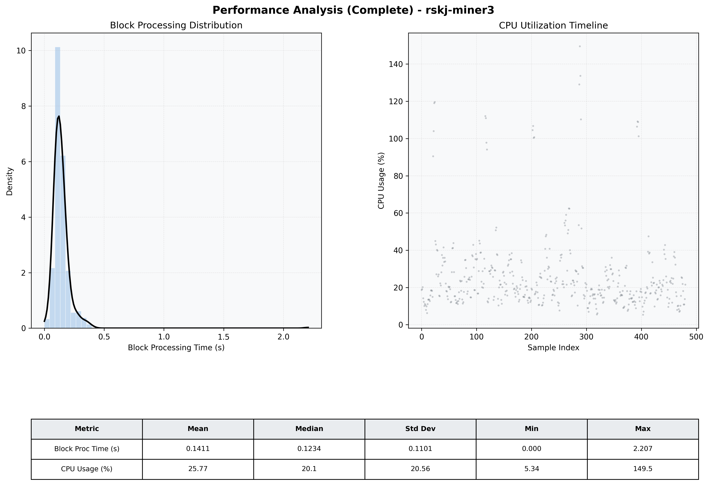

# Miner3 Quantitative Performance Report

| Category | Metric | Unit | Mean | Median | Min | Max |
| :--- | :--- | :--- | :--- | :--- | :--- | :--- |
| Processing | Block Processing Time | s | 0.141 | 0.123 | 0.000 | 2.207 |
|  | BlockExecution JMX | s | 0.079 | 0.064 | 0.004 | 2.137 |
| | Gas Consumed (per block) | M units | 14.90 | 15.14 | 0.00 | 15.25 |
| Resources | CPU Usage per Container | % | 25.77 | 20.11 | 5.34 | 149.53 |
|  | Memory Usage per Container | MiB | 3800.7 | 3841.9 | 3531.5 | 4032.5 |
| JVM | JVM Heap Used | MiB | 1379.7 | 1384.5 | 517.5 | 2225.6 |
| | JVM Heap Allocated | MiB | 2969.6 | 2969.6 | 2969.6 | 2969.6 |
| JVM GC | GC Copy Time | s | 0.0030 | 0.0026 | 0.000 | 0.019 |
| JVM GC | GC MarkSweep Time | s | 0.0000 | 0.0000 | 0.000 | 0.000 |
| Disk I/O | Disk Read | MiB/s | 113.556 | 0.000 | 0.000 | 25189.737 |
|  | Disk Write | MiB/s | 222.891 | 10.069 | 0.552 | 41329.011 |
| Network | Received Network Traffic per Container | KiB/s | 3.02 | 2.08 | 1.15 | 10.97 |
|  | Sent Network Traffic per Container | KiB/s | 11.71 | 10.92 | 9.77 | 18.49 |

