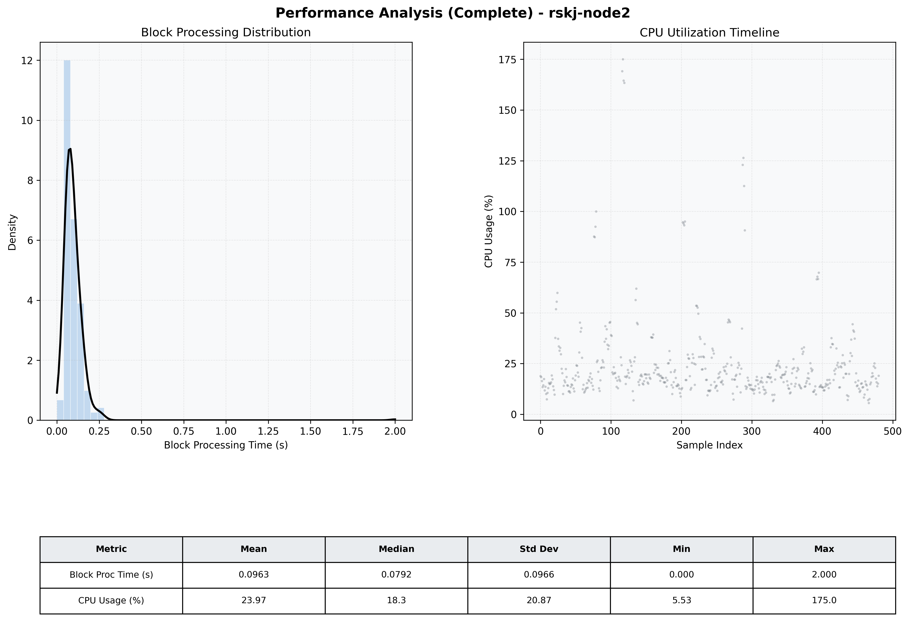

# Node2 Quantitative Performance Report

| Category | Metric | Unit | Mean | Median | Min | Max |
| :--- | :--- | :--- | :--- | :--- | :--- | :--- |
| Processing | Block Processing Time | s | 0.096 | 0.079 | 0.000 | 2.000 |
|  | BlockExecution JMX | s | 0.095 | 0.074 | 0.001 | 2.831 |
| | Gas Consumed (per block) | M units | 14.90 | 15.14 | 0.00 | 15.25 |
| Resources | CPU Usage per Container | % | 23.97 | 18.25 | 5.53 | 174.97 |
|  | Memory Usage per Container | MiB | 3817.2 | 3839.7 | 3637.6 | 4095.2 |
| JVM | JVM Heap Used | MiB | 1381.4 | 1388.7 | 559.5 | 2189.3 |
| | JVM Heap Allocated | MiB | 2969.6 | 2969.6 | 2969.6 | 2969.6 |
| JVM GC | GC Copy Time | s | 0.0027 | 0.0024 | 0.000 | 0.030 |
| JVM GC | GC MarkSweep Time | s | 0.0000 | 0.0000 | 0.000 | 0.000 |
| Disk I/O | Disk Read | MiB/s | 103.175 | 0.000 | 0.000 | 25339.265 |
|  | Disk Write | MiB/s | 203.182 | 1.379 | 0.000 | 37138.837 |
| Network | Received Network Traffic per Container | KiB/s | 3.02 | 2.05 | 1.16 | 10.74 |
|  | Sent Network Traffic per Container | KiB/s | 11.58 | 10.77 | 9.65 | 18.29 |

