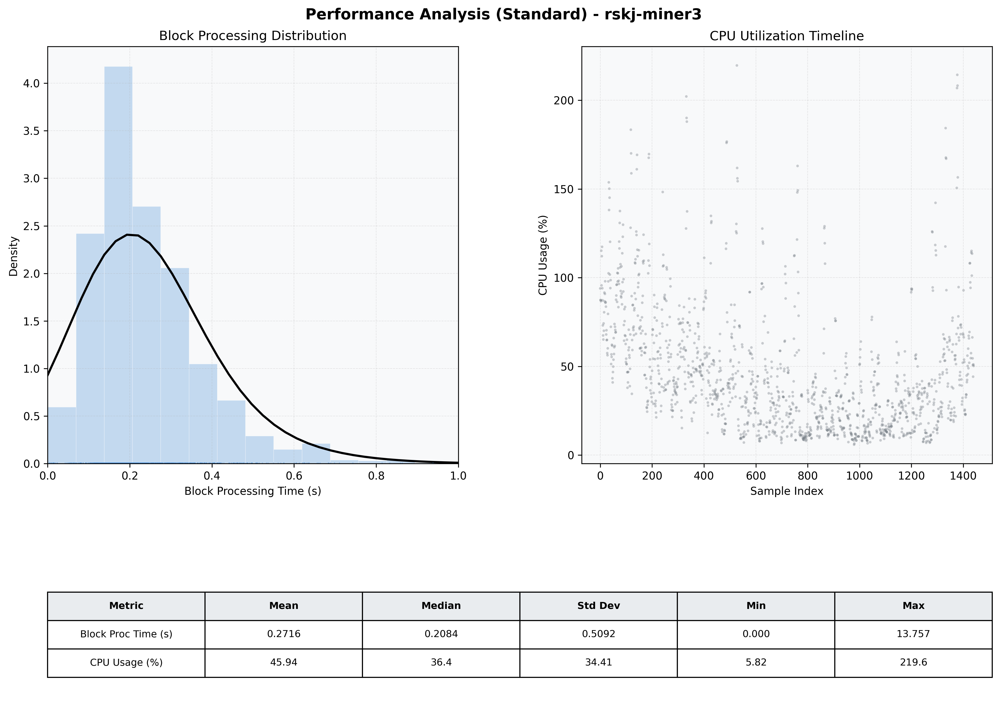

# Miner3 Quantitative Performance Report

| Category | Metric | Unit | Mean | Median | Min | Max |
| :--- | :--- | :--- | :--- | :--- | :--- | :--- |
| Processing | Block Processing Time | s | 0.272 | 0.208 | 0.000 | 13.757 |
|  | BlockExecution JMX | s | 0.139 | 0.109 | 0.002 | 0.835 |
| | Gas Consumed (per block) | M units | 22.59 | 24.67 | 0.00 | 24.79 |
| Resources | CPU Usage per Container | % | 45.94 | 36.42 | 5.82 | 219.62 |
|  | Memory Usage per Container | MiB | 3831.8 | 3854.8 | 3639.2 | 4095.8 |
| Disk I/O | Disk Read | MiB/s | 349.694 | 1.379 | 0.000 | 67908.411 |
|  | Disk Write | MiB/s | 488.423 | 4.412 | 0.000 | 73781.303 |
| Network | Received Network Traffic per Container | KiB/s | 2.75 | 2.26 | 0.89 | 9.93 |
|  | Sent Network Traffic per Container | KiB/s | 11.52 | 11.11 | 4.44 | 19.32 |

