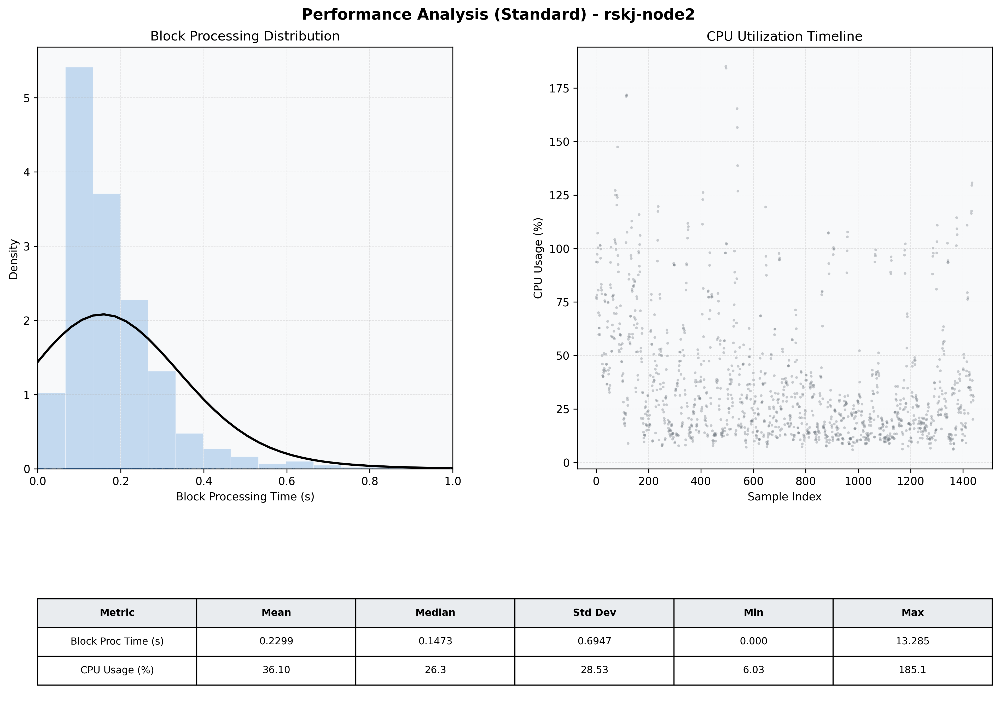

# Node2 Quantitative Performance Report

| Category | Metric | Unit | Mean | Median | Min | Max |
| :--- | :--- | :--- | :--- | :--- | :--- | :--- |
| Processing | Block Processing Time | s | 0.230 | 0.147 | 0.000 | 13.285 |
|  | BlockExecution JMX | s | 0.164 | 0.137 | 0.001 | 0.922 |
| | Gas Consumed (per block) | M units | 22.59 | 24.67 | 0.00 | 24.79 |
| Resources | CPU Usage per Container | % | 36.10 | 26.25 | 6.03 | 185.14 |
|  | Memory Usage per Container | MiB | 3965.4 | 3972.2 | 3885.0 | 4095.9 |
| Disk I/O | Disk Read | MiB/s | 358.078 | 0.552 | 0.000 | 72408.180 |
|  | Disk Write | MiB/s | 494.505 | 1.379 | 0.000 | 79873.780 |
| Network | Received Network Traffic per Container | KiB/s | 2.76 | 2.28 | 1.03 | 9.78 |
|  | Sent Network Traffic per Container | KiB/s | 11.23 | 10.86 | 5.12 | 16.91 |

