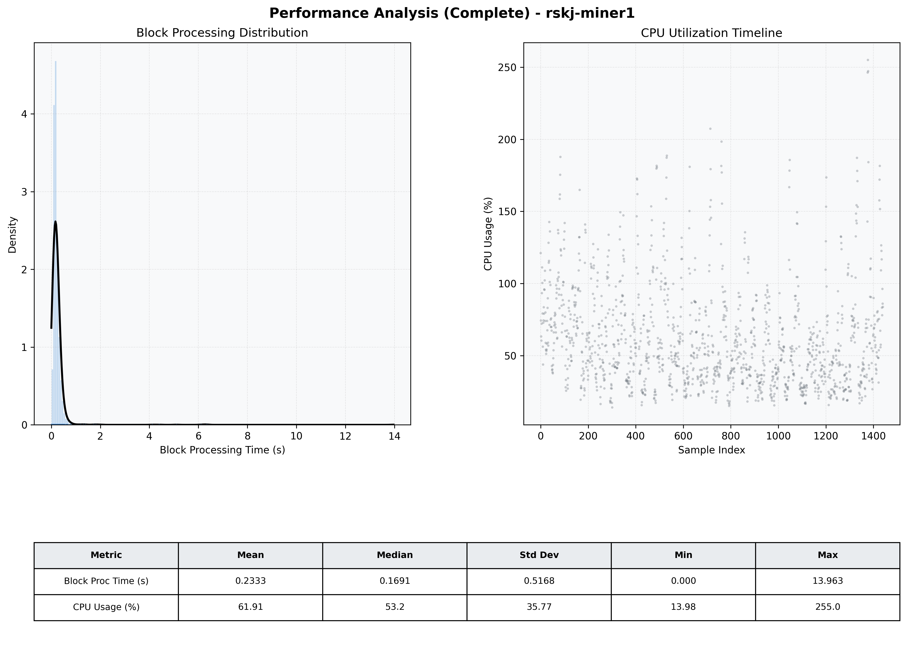

# Miner1 Quantitative Performance Report

| Category | Metric | Unit | Mean | Median | Min | Max |
| :--- | :--- | :--- | :--- | :--- | :--- | :--- |
| Processing | Block Processing Time | s | 0.233 | 0.169 | 0.000 | 13.963 |
|  | BlockExecution JMX | s | 0.154 | 0.092 | 0.001 | 13.872 |
| | Gas Consumed (per block) | M units | 22.59 | 24.67 | 0.00 | 24.79 |
| Resources | CPU Usage per Container | % | 61.91 | 53.15 | 13.98 | 255.02 |
|  | Memory Usage per Container | MiB | 3934.0 | 3935.2 | 3657.3 | 4096.0 |
| Disk I/O | Disk Read | MiB/s | 373.249 | 1.241 | 0.000 | 62273.301 |
|  | Disk Write | MiB/s | 598.522 | 58.619 | 0.000 | 70378.677 |
| Network | Received Network Traffic per Container | KiB/s | 22.56 | 13.94 | 1.46 | 70.97 |
|  | Sent Network Traffic per Container | KiB/s | 27.57 | 21.96 | 9.92 | 69.37 |

