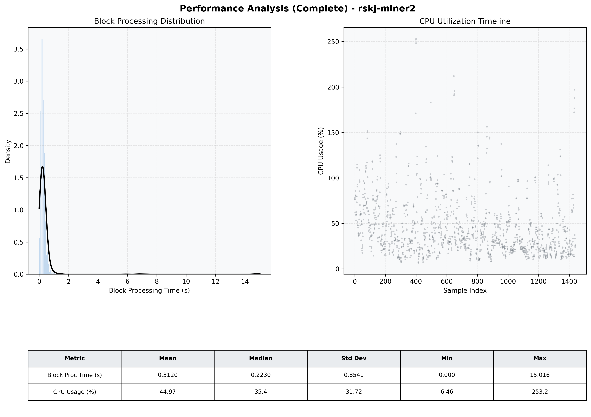

# Miner2 Quantitative Performance Report

| Category | Metric | Unit | Mean | Median | Min | Max |
| :--- | :--- | :--- | :--- | :--- | :--- | :--- |
| Processing | Block Processing Time | s | 0.312 | 0.223 | 0.000 | 15.016 |
|  | BlockExecution JMX | s | 0.191 | 0.118 | 0.002 | 14.534 |
| | Gas Consumed (per block) | M units | 22.59 | 24.67 | 0.00 | 24.79 |
| Resources | CPU Usage per Container | % | 44.97 | 35.39 | 6.46 | 253.19 |
|  | Memory Usage per Container | MiB | 3907.5 | 3922.6 | 3680.8 | 4096.0 |
| Disk I/O | Disk Read | MiB/s | 373.111 | 0.552 | 0.000 | 65492.568 |
|  | Disk Write | MiB/s | 508.732 | 4.276 | 0.000 | 73451.736 |
| Network | Received Network Traffic per Container | KiB/s | 2.72 | 2.24 | 1.09 | 9.71 |
|  | Sent Network Traffic per Container | KiB/s | 11.51 | 11.08 | 6.09 | 17.80 |

