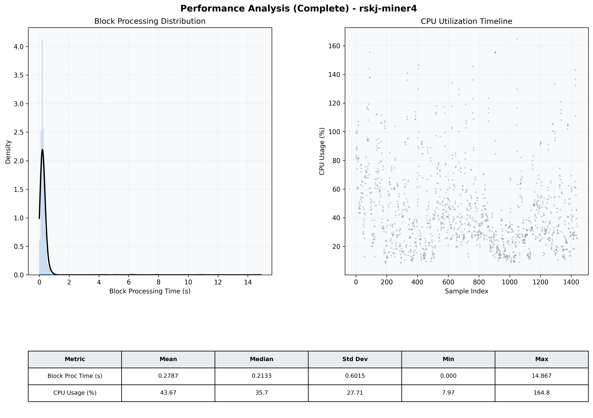

# Miner4 Quantitative Performance Report

| Category | Metric | Unit | Mean | Median | Min | Max |
| :--- | :--- | :--- | :--- | :--- | :--- | :--- |
| Processing | Block Processing Time | s | 0.279 | 0.213 | 0.000 | 14.867 |
|  | BlockExecution JMX | s | 0.190 | 0.114 | 0.002 | 16.463 |
| | Gas Consumed (per block) | M units | 22.59 | 24.67 | 0.00 | 24.79 |
| Resources | CPU Usage per Container | % | 43.67 | 35.74 | 7.97 | 164.82 |
|  | Memory Usage per Container | MiB | 3950.0 | 3974.9 | 3696.2 | 4096.0 |
| Disk I/O | Disk Read | MiB/s | 351.413 | 1.103 | 0.000 | 64210.911 |
|  | Disk Write | MiB/s | 487.817 | 4.276 | 0.000 | 71943.720 |
| Network | Received Network Traffic per Container | KiB/s | 2.76 | 2.24 | 1.17 | 9.90 |
|  | Sent Network Traffic per Container | KiB/s | 11.50 | 11.07 | 5.42 | 19.97 |

