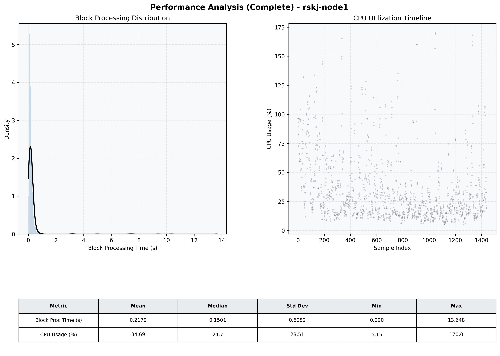

# Node1 Quantitative Performance Report

| Category | Metric | Unit | Mean | Median | Min | Max |
| :--- | :--- | :--- | :--- | :--- | :--- | :--- |
| Processing | Block Processing Time | s | 0.218 | 0.150 | 0.000 | 13.648 |
|  | BlockExecution JMX | s | 0.233 | 0.137 | 0.001 | 21.463 |
| | Gas Consumed (per block) | M units | 22.59 | 24.67 | 0.00 | 24.79 |
| Resources | CPU Usage per Container | % | 34.69 | 24.71 | 5.15 | 169.98 |
|  | Memory Usage per Container | MiB | 3888.3 | 3895.2 | 3631.1 | 4095.6 |
| Disk I/O | Disk Read | MiB/s | 342.837 | 1.241 | 0.000 | 61799.510 |
|  | Disk Write | MiB/s | 484.305 | 1.517 | 0.000 | 69049.140 |
| Network | Received Network Traffic per Container | KiB/s | 2.76 | 2.27 | 1.14 | 9.80 |
|  | Sent Network Traffic per Container | KiB/s | 11.25 | 10.87 | 5.66 | 16.58 |

