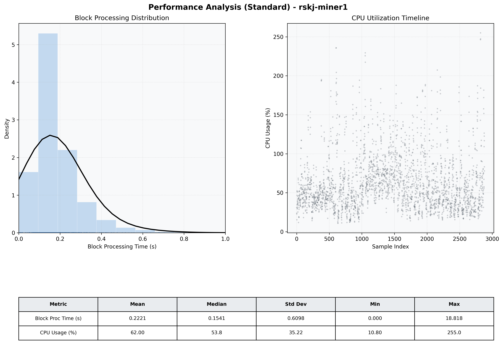

# Miner1 Quantitative Performance Report

| Category | Metric | Unit | Mean | Median | Min | Max |
| :--- | :--- | :--- | :--- | :--- | :--- | :--- |
| Processing | Block Processing Time | s | 0.222 | 0.154 | 0.000 | 18.818 |
|  | BlockExecution JMX | s | 0.109 | 0.086 | 0.001 | 0.863 |
| | Gas Consumed (per block) | M units | 22.01 | 24.66 | 0.00 | 24.79 |
| Resources | CPU Usage per Container | % | 62.00 | 53.76 | 10.80 | 255.02 |
|  | Memory Usage per Container | MiB | 3715.3 | 3910.0 | 1600.1 | 4096.0 |
| Disk I/O | Disk Read | MiB/s | 256.981 | 0.138 | 0.000 | 62273.301 |
|  | Disk Write | MiB/s | 493.002 | 83.727 | 0.000 | 70378.677 |
| Network | Received Network Traffic per Container | KiB/s | 24.57 | 18.74 | 0.78 | 91.90 |
|  | Sent Network Traffic per Container | KiB/s | 29.57 | 24.07 | 5.03 | 80.97 |

