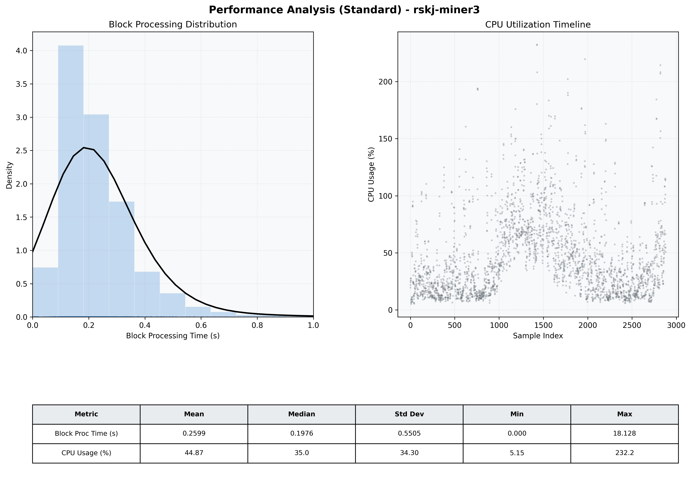

# Miner3 Quantitative Performance Report

| Category | Metric | Unit | Mean | Median | Min | Max |
| :--- | :--- | :--- | :--- | :--- | :--- | :--- |
| Processing | Block Processing Time | s | 0.260 | 0.198 | 0.000 | 18.128 |
|  | BlockExecution JMX | s | 0.138 | 0.107 | 0.002 | 0.955 |
| | Gas Consumed (per block) | M units | 22.01 | 24.66 | 0.00 | 24.79 |
| Resources | CPU Usage per Container | % | 44.87 | 34.98 | 5.15 | 232.23 |
|  | Memory Usage per Container | MiB | 3661.6 | 3853.8 | 1597.8 | 4096.0 |
| Disk I/O | Disk Read | MiB/s | 243.066 | 0.138 | 0.000 | 67906.069 |
|  | Disk Write | MiB/s | 390.980 | 4.690 | 0.000 | 73778.759 |
| Network | Received Network Traffic per Container | KiB/s | 2.73 | 2.11 | 0.59 | 10.79 |
|  | Sent Network Traffic per Container | KiB/s | 11.37 | 10.99 | 4.44 | 19.32 |

