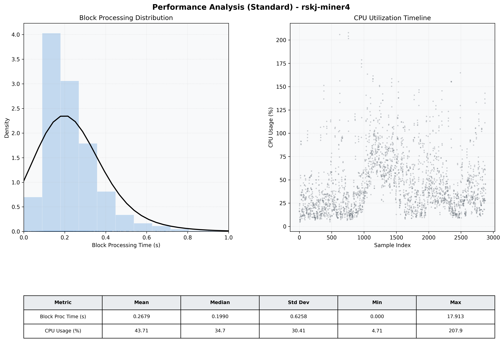

# Miner4 Quantitative Performance Report

| Category | Metric | Unit | Mean | Median | Min | Max |
| :--- | :--- | :--- | :--- | :--- | :--- | :--- |
| Processing | Block Processing Time | s | 0.268 | 0.199 | 0.000 | 17.913 |
|  | BlockExecution JMX | s | 0.138 | 0.109 | 0.001 | 0.774 |
| | Gas Consumed (per block) | M units | 22.01 | 24.66 | 0.00 | 24.79 |
| Resources | CPU Usage per Container | % | 43.71 | 34.72 | 4.71 | 207.89 |
|  | Memory Usage per Container | MiB | 3732.3 | 3922.2 | 1623.8 | 4096.0 |
| Disk I/O | Disk Read | MiB/s | 247.731 | 0.000 | 0.000 | 64206.483 |
|  | Disk Write | MiB/s | 384.439 | 4.827 | 0.000 | 71938.759 |
| Network | Received Network Traffic per Container | KiB/s | 2.73 | 2.11 | 0.57 | 10.81 |
|  | Sent Network Traffic per Container | KiB/s | 11.35 | 10.97 | 4.36 | 19.97 |

