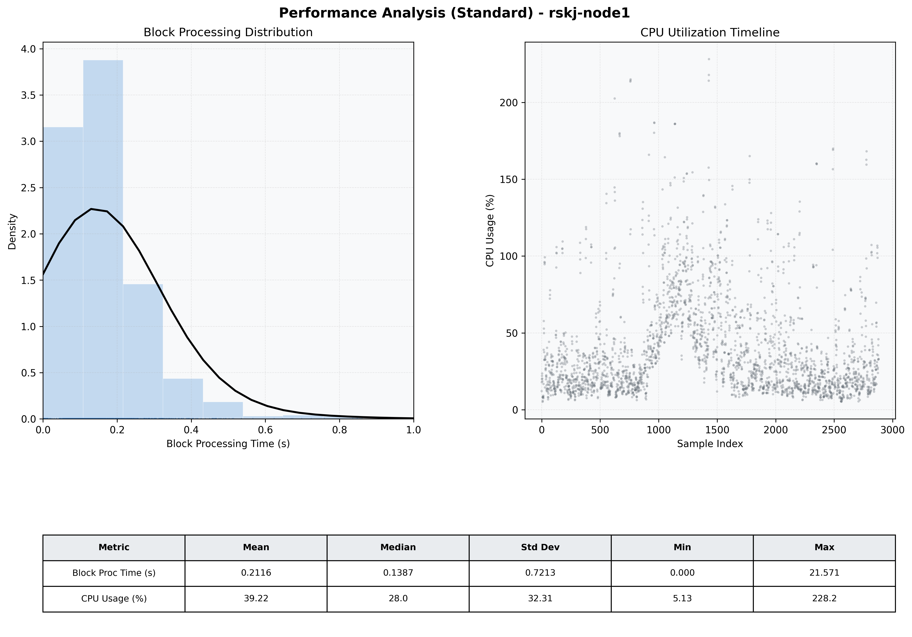

# Node1 Quantitative Performance Report

| Category | Metric | Unit | Mean | Median | Min | Max |
| :--- | :--- | :--- | :--- | :--- | :--- | :--- |
| Processing | Block Processing Time | s | 0.212 | 0.139 | 0.000 | 21.571 |
|  | BlockExecution JMX | s | 0.156 | 0.130 | 0.001 | 0.910 |
| | Gas Consumed (per block) | M units | 22.01 | 24.66 | 0.00 | 24.79 |
| Resources | CPU Usage per Container | % | 39.22 | 27.98 | 5.13 | 228.24 |
|  | Memory Usage per Container | MiB | 3685.7 | 3891.8 | 1578.0 | 4095.8 |
| Disk I/O | Disk Read | MiB/s | 234.717 | 0.000 | 0.000 | 61797.379 |
|  | Disk Write | MiB/s | 380.435 | 1.379 | 0.000 | 69046.759 |
| Network | Received Network Traffic per Container | KiB/s | 2.74 | 2.12 | 0.56 | 10.92 |
|  | Sent Network Traffic per Container | KiB/s | 11.12 | 10.77 | 4.66 | 21.25 |

