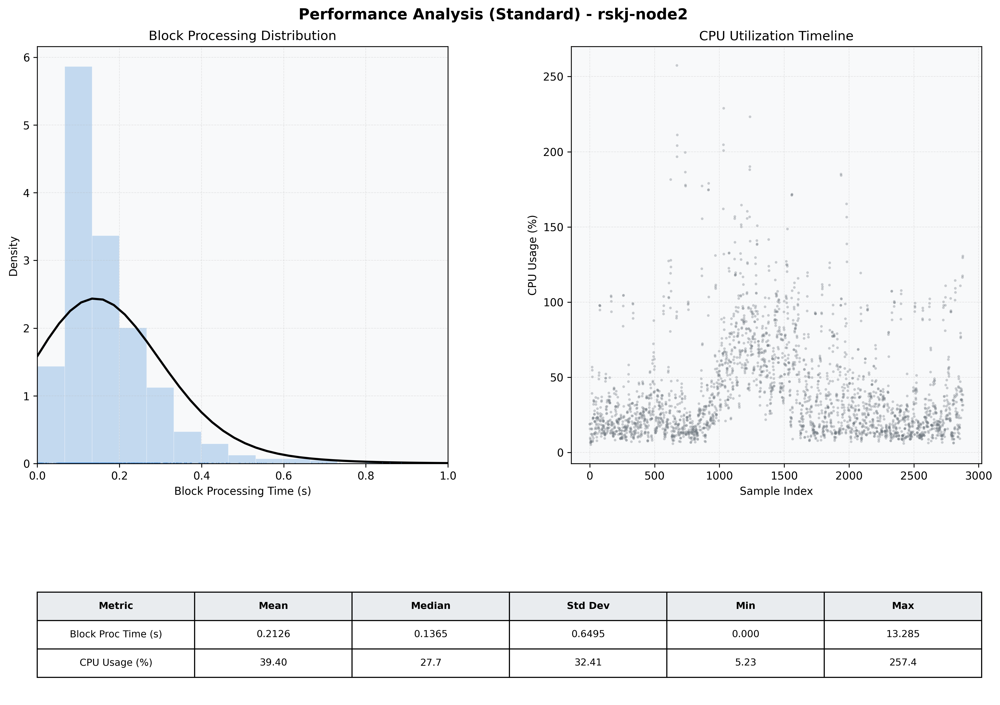

# Node2 Quantitative Performance Report

| Category | Metric | Unit | Mean | Median | Min | Max |
| :--- | :--- | :--- | :--- | :--- | :--- | :--- |
| Processing | Block Processing Time | s | 0.213 | 0.137 | 0.000 | 13.285 |
|  | BlockExecution JMX | s | 0.157 | 0.129 | 0.001 | 0.922 |
| | Gas Consumed (per block) | M units | 22.01 | 24.66 | 0.00 | 24.79 |
| Resources | CPU Usage per Container | % | 39.40 | 27.72 | 5.23 | 257.39 |
|  | Memory Usage per Container | MiB | 3733.2 | 3957.5 | 1730.6 | 4095.9 |
| Disk I/O | Disk Read | MiB/s | 244.366 | 0.000 | 0.000 | 72403.186 |
|  | Disk Write | MiB/s | 383.112 | 1.379 | 0.000 | 79868.271 |
| Network | Received Network Traffic per Container | KiB/s | 2.74 | 2.13 | 0.57 | 13.74 |
|  | Sent Network Traffic per Container | KiB/s | 11.12 | 10.77 | 2.22 | 53.52 |

